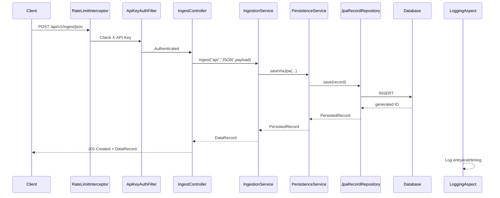
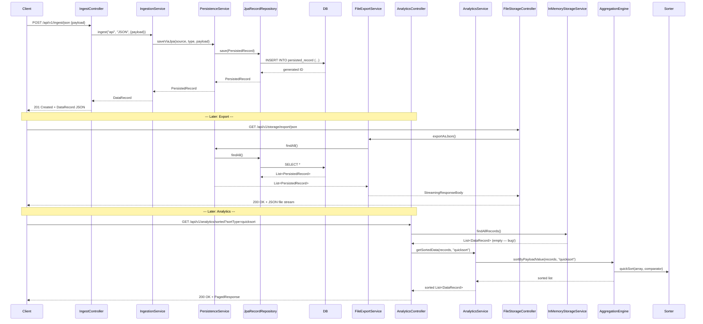
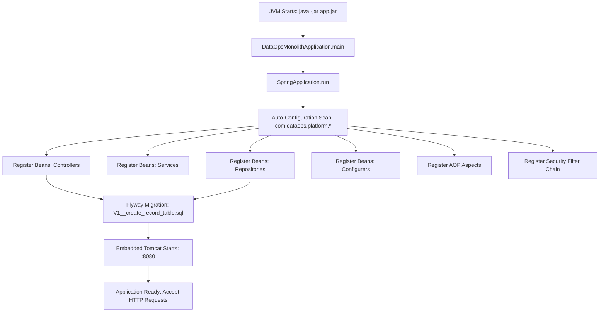

# PROJECT_ARCHITECTURE.md — DataOps Backend Platform

# Forensic Codebase Architecture & Implementation Analysis

## 0. Project Context

| Field | Value |
| ----- | ----- |
| **Project Name** | DataOps Backend Platform |
| **Primary Language** | Java 17 |
| **Core Frameworks** | Spring Boot 3.3.4, Spring Web, Spring Data JPA, Spring Security, Spring AOP |
| **Persistence** | JPA/Hibernate + H2 (default, file-backed) / PostgreSQL (runtime) + Flyway migrations |
| **Build Tool** | Maven (with Maven Wrapper) |
| **Deployment** | Docker container, docker-compose |
| **Messaging** | Apache Kafka (disabled by default; no-op fallback) |
| **Architecture** | Multi-module modular monolith |

---

# 1. Executive Summary & System Boundaries

## 1.1 Project Purpose

The DataOps Backend Platform is a production-ready multi-module Spring Boot monolith for data ingestion, storage, analytics, and export. It exposes REST APIs for ingesting JSON, CSV, and XML data records, stores them in a database (H2 by default, PostgreSQL via `docker-compose.yml`), provides analytics and sorting endpoints, and supports streaming exports as JSON and CSV.

**Evidence:**

* README.md (lines 1–138): Describes the project purpose, stack, and endpoints.
* `pom.xml` (root, lines 1–69): Declares 9 modules forming a modular monolith.
* `dataops-platform-monolith/src/main/java/com/dataops/platform/monolith/DataOpsMonolithApplication.java`: The monolithic entry point.

## 1.2 Target Actors

| Actor | Interaction Point | Source Location |
| ----- | ----------------- | --------------- |
| HTTP API client (e.g., Swagger UI, frontend, curl) | `POST /api/v1/ingest/json`, `/csv`, `/xml`, `/file` | `IngestController.java` |
| HTTP API client | `GET /api/v1/records`, `/by-source`, `/by-id` | `RecordsController.java` |
| HTTP API client | `GET /api/v1/analytics/stats`, `/sorted` | `AnalyticsController.java` |
| HTTP API client | `GET /api/v1/storage/export/json`, `/csv`, `/binary` | `FileStorageController.java` |
| API caller (API key auth) | All `/api/**` endpoints | `SecurityConfig.java` (ApiKeyAuthFilter) |
| Internal event listener | Subscribes to `DataRecordIngestedEvent` | `KafkaRecordPublisher.java` |
| Background async task | `AsyncFileWriter` | `AsyncFileWriter.java` |
| CI/CD pipeline | JUnit + Mockito tests + JMH benchmarks | `.github/workflows` |
| Docker runtime | Docker container build | `Dockerfile` |

## 1.3 System Boundaries

### Inside the Repository

- **All modules** (`module-00` through `module-08`) plus `common-test` and the `dataops-platform-monolith` are part of the repository.
- Each module is a Maven sub-project within the monorepo structure.
- No frontend code exists in this repository.

### Outside the Repository

- **External databases**: PostgreSQL (used in `docker-compose.yml` and in the monolith `application.yml` default). H2 is also used as file-backed storage.
- **Kafka brokers**: Referenced by the Kafka producer implementation but disabled by default.
- **External API clients**: Any HTTP client consuming the REST API.

## 1.4 Architectural Paradigm

**Classification: Modular Monolith**

**Observed fact:** A single deployable JAR (`dataops-platform-monolith`) aggregates all modules (`module-00` through `module-08`) at build time. This is confirmed by:

* `dataops-platform-monolith/pom.xml` (lines 22–57): Declares dependencies on all functional modules.
* `dataops-platform-monolith/src/main/java/com/dataops/platform/monolith/DataOpsMonolithApplication.java` (line 8–11): Uses `@SpringBootApplication`, `@EnableJpaRepositories`, and `@EntityScan` with `basePackages = "com.dataops.platform"`, scanning across all modules.
* Dockerfile (lines 7, 18) — Builds and deploys a single Spring Boot fat JAR.

This is not a multi-service microservice architecture; the modules are logical separations within a single deployable unit with well-defined dependency directions.

---

# 2. Repository Structure & File Organization

## 2.1 Root Directory

| Path | Type | Purpose | Evidence |
| ---- | ---- | ------- | -------- |
| `pom.xml` | File | Parent POM; declares modules, Java 17, Spring Boot 3.3.4 | Root `pom.xml` |
| `README.md` | File | Project documentation | `README.md` |
| `Dockerfile` | File | Multi-stage Docker build for the monolith | `Dockerfile` |
| `docker-compose.yml` | File | Local docker-compose with PostgreSQL service | `docker-compose.yml` |
| `run.sh` | File | Linux/macOS run script | `run.sh` (lines 1–37) |
| `run.bat` | File | Windows run script | `run.bat` (lines 1–49) |
| `mvnw`, `mvnw.cmd` | File | Maven Wrapper binaries | `.mvn/wrapper/maven-wrapper.properties` |
| `.mvn/wrapper` | Directory | Maven Wrapper configuration | Maven wrapper properties |
| `.github/workflows` | Directory | CI/CD pipeline definition | `.github/workflows` (lines 1–52) |
| `.github/modernize` | Directory | Java upgrade hooks | `.github/modernize/java-upgrade/hooks/scripts/*` |
| `.dockerignore` | File | Docker build exclusions | `.dockerignore` |
| `LICENSE` | File | MIT License | `LICENSE` |
| `.gitignore` | File | Git ignore rules | `.gitignore` |
| `.idea/`, `.vscode/` | Directories | IDE configuration | `.vscode/settings.json`, `.idea/*` |
| `monolith.out.log`, `monolith.err.log` | Files | Runtime logs | Runtime artifact |
| `data/` | Directory | Runtime H2 data files | `data/dataops.mv.db` |
| `dataops-platform-monolith/` | Module Directory | Main Spring Boot monolith application | Contains `src/main/java/.../DataOpsMonolithApplication.java` |
| `module-00-common-models/` | Module Directory | Shared DTOs, domain objects, events | `DataRecord.java`, `PagedResponse.java`, `DataRecordIngestedEvent.java` |
| `module-01-core/` | Module Directory | Custom collections and algorithms | `DynamicArray.java`, `RingBuffer.java`, `Sorter.java`, `SimpleInMemoryIndex.java`, `CustomQueue.java` |
| `module-02-in-memory-engine/` | Module Directory | REST controllers for ingestion and record retrieval | `IngestController.java`, `RecordsController.java`, `InMemoryStorageService.java`, `IngestionService.java` |
| `module-03-persistence/` | Module Directory | JPA entity, repository, persistence service | `PersistedRecord.java`, `PersistenceService.java`, `JpaRecordRepository.java` |
| `module-04-file-storage/` | Module Directory | JSON/CSV/Binary export services | `FileExportService.java`, `BinaryRecordSerializer.java`, `AsyncFileWriter.java`, `FileStorageController.java` |
| `module-05-analytics/` | Module Directory | Analytics and sorting engines with JMH benchmarks | `AnalyticsService.java`, `AggregationEngine.java`, `AnalyticsController.java`, `SortBenchmark.java` |
| `module-06-streaming-kafka/` | Module Directory | Kafka event streaming (optional, disabled by default) | `KafkaProducer.java`, `NoOpKafkaProducer.java`, `KafkaDataProducer.java`, `KafkaRecordPublisher.java` |
| `module-07-api/` | Module Directory | API cross-cutting concerns: OpenAPI, rate limiting, global exception handling | `OpenApiConfig.java`, `RateLimitConfig.java`, `GlobalExceptionHandler.java`, `ErrorResponse.java` |
| `module-08-aop-logging/` | Module Directory | Aspect-oriented request/response logging | `LoggingAspect.java` |
| `common-test/` | Module Directory | Common test utilities (TestContainers, Faker) | `TestUtils.java` |

## 2.2 Source Tree

| Module | Source Root | Key Classes | Responsibility |
| ------ | ----------- | ----------- | -------------- |
| `module-00-common-models` | `com.dataops.platform.common` | `DataRecord`, `PagedResponse`, `DataRecordIngestedEvent` | DTOs, domain models, application events (no external deps beyond Jackson) |
| `module-01-core` | `com.dataops.platform.core` | `DynamicArray`, `RingBuffer`, `SimpleInMemoryIndex`, `CustomQueue`, `Sorter` | Zero-dependency custom data structures and algorithms |
| `module-02-in-memory-engine` | `com.dataops.platform.inmemory` | `IngestController`, `RecordsController`, `InMemoryStorageService`, `IngestionService` | REST ingest/record endpoints + in-memory caching layer |
| `module-03-persistence` | `com.dataops.platform.persistence` | `PersistedRecord`, `PersistenceService`, `JpaRecordRepository`, `MapToJsonConverter` | JPA entity, repository abstraction, JSON column converter, Flyway migration |
| `module-04-file-storage` | `com.dataops.platform.filestorage` | `FileExportService`, `BinaryRecordSerializer`, `AsyncFileWriter`, `FileStorageController` | Streaming export (JSON, CSV), async file writing |
| `module-05-analytics` | `com.dataops.platform.analytics` | `AnalyticsService`, `AggregationEngine`, `AnalyticsController`, `SortBenchmark` | Aggregation, custom sort algorithm benchmarking |
| `module-06-streaming-kafka` | `com.dataops.platform.streaming` | `KafkaProducer`, `NoOpKafkaProducer`, `KafkaDataProducer`, `KafkaRecordPublisher` | Event publishing via Kafka with conditional no-op fallback |
| `module-07-api` | `com.dataops.platform.api` | `OpenApiConfig`, `RateLimitConfig`, `GlobalExceptionHandler`, `ErrorResponse` | API configuration, security, error handling, documentation |
| `module-08-aop-logging` | `com.dataops.platform.aop` | `LoggingAspect` | AOP-based operational logging |
| `dataops-platform-monolith` | `com.dataops.platform` | `DataOpsMonolithApplication`, `SecurityConfig`, `JacksonConfig`, `CacheConfig`, `AsyncConfig` | Main application bootstrap + central Spring configuration |
| `common-test` | `com.dataops.platform.test` | `TestUtils` | Shared test utilities |

## 2.3 Dependency Management

* **Build system:** Maven 3.x (declared via Maven Wrapper in `.mvn/wrapper/`)
* **Parent POM:** `dataops-backend-platform` version `0.0.1-SNAPSHOT` packaging type `pom`
* **Managed dependencies:** Spring Boot BOM `3.3.4` imported in `dependencyManagement`
* **Java version:** Compiler release set to 17 (`<release>17</release>`)
* **No lock file:** Maven does not use lock files by convention; versions managed centrally through parent POM and Spring Boot BOM
* **Plugins:** `maven-compiler-plugin` 3.13.0, `maven-surefire-plugin` 3.5.0, `spring-boot-maven-plugin` 3.3.4
* **Compiler argument:** `-parameters` flag passed for reflection-based parameter names

---

# 3. High-Level Architecture

## 3.1 Architecture Pattern

**Modular Monolith with Layered Internal Architecture**

Each module follows a layered pattern (API → Service → Repository), but the entire system deploys as a single Spring Boot application.

* `DataOpsMonolithApplication` (lines 8–11): Single `@SpringBootApplication` with base package scan at `com.dataops.platform` covering all modules.
* `JpaRepository`, `@Entity`, `@RestController`, `@Service`, `@Bean` — all co-located in one runtime.

## 3.2 Component Map

| Component | Package | Responsibility | Depends On | Used By |
| --------- | ------ | -------------- | ---------- | ------- |
| `InMemoryStorageService` | `com.dataops.platform.inmemory.service` | In-memory caching with concurrent collections | `module-00-common-models` | `AnalyticsController` (reads records) |
| `IngestionService` | `com.dataops.platform.inmemory.service` | Coordinates ingestion by delegating to persistence | `PersistenceService` | `IngestController` |
| `IngestController` | `com.dataops.platform.inmemory.api` | REST endpoints: `/api/v1/ingest/{json,csv,xml,file}` | `IngestionService`, Jackson | HTTP clients |
| `RecordsController` | `com.dataops.platform.inmemory.api` | REST endpoints: `/api/v1/records` | `PersistenceService` | HTTP clients |
| `PersistenceService` | `com.dataops.platform.persistence.service` | JPA-based persistence orchestration | `JpaRecordRepository` | `IngestionService`, `FileExportService`, `RecordsController`, `AnalyticsController` |
| `PersistedRecord` | `com.dataops.platform.persistence.entity` | JPA entity mapped to `persisted_record` table | `MapToJsonConverter` | `JpaRecordRepository` |
| `JpaRecordRepository` | `com.dataops.platform.persistence.repository.jpa` | Spring Data JPA repository | Spring Data JPA | `PersistenceService` |
| `MapToJsonConverter` | `com.dataops.platform.persistence.converter` | JPA attribute converter for payload Map→JSON | Jackson `ObjectMapper` | `PersistedRecord` |
| `FileExportService` | `com.dataops.platform.filestorage.service` | Streaming export (JSON/CSV) | `PersistenceService`, Jackson | `FileStorageController` |
| `BinaryRecordSerializer` | `com.dataops.platform.filestorage.service` | Binary format serializer (placeholder) | None | (not yet used) |
| `AsyncFileWriter` | `com.dataops.platform.filestorage.async` | Async file writing | Spring `@Async` | (not yet wired/used) |
| `FileStorageController` | `com.dataops.platform.filestorage.api` | REST export endpoints | `FileExportService` | HTTP clients |
| `AnalyticsService` | `com.dataops.platform.analytics.service` | Stats + sorting + metrics | `AggregationEngine`, Micrometer | `AnalyticsController` |
| `AggregationEngine` | `com.dataops.platform.analytics.service` | Group-by, average, sort logic | `Sorter` | `AnalyticsService` |
| `AnalyticsController` | `com.dataops.platform.analytics.api` | REST analytics endpoints | `AnalyticsService`, `InMemoryStorageService` | HTTP clients |
| `SortBenchmark` | `com.dataops.platform.analytics.benchmark` | JMH micro-benchmarks for Sorter | `Sorter` | CI/CD pipeline |
| `KafkaProducer` (interface) | `com.dataops.platform.streaming.producer` | Abstraction for event publishing | None | `KafkaRecordPublisher` |
| `NoOpKafkaProducer` | `com.dataops.platform.streaming.producer` | Fallback producer when Kafka disabled | None | Spring context (conditional) |
| `KafkaDataProducer` | `com.dataops.platform.streaming.producer` | Real Kafka producer | Spring-Kafka | Spring context (conditional) |
| `KafkaRecordPublisher` | `com.dataops.platform.streaming.kafka` | Event listener: publishes on record ingest | `KafkaProducer` | Spring (event-driven) |
| `LoggingAspect` | `com.dataops.platform.aop` | AOP logging for controllers + services | Jackson `ObjectMapper` | Spring AOP |
| `SecurityConfig` | `com.dataops.platform.monolith.config` | Spring Security + API key auth filter | Spring Security | `DataOpsMonolithApplication` |
| `JacksonConfig` | `com.dataops.platform.monolith.config` | ObjectMapper + XmlMapper (XXE-safe) | Jackson | Spring context |
| `CacheConfig` | `com.dataops.platform.monolith.config` | Caffeine cache manager with 5 named caches | Caffeine | Spring caching abstraction |
| `AsyncConfig` | `com.dataops.platform.monolith.config` | Thread pool for async file writer | Spring `@Async` | `AsyncFileWriter` |
| `OpenApiConfig` | `com.dataops.platform.api.config` | OpenAPI 3 spec, CORS config | springdoc-openapi | Spring context |
| `RateLimitConfig` | `com.dataops.platform.api.config` | Per-IP rate limiting (100 req/min) | Caffeine | Spring MVC interceptors |
| `GlobalExceptionHandler` | `com.dataops.platform.api.config` | Centralized exception→HTTP mapping | Spring MVC | All controllers |
| `DataRecord` | `com.dataops.platform.common.model` | Domain DTO for ingested records | None | All modules |
| `PagedResponse` | `com.dataops.platform.common.dto` | Pagination wrapper | None | Controllers |
| `DataRecordIngestedEvent` | `com.dataops.platform.common.event` | Spring ApplicationEvent for ingest | `DataRecord` | `InMemoryStorageService`, `KafkaRecordPublisher` |

## 3.3 Dependency Direction

The dependency flow is directed and unidirectional:

```
module-06-streaming-kafka ──┐
                             ↓
                 module-08-aop-logging
                             ↓
module-07-api ──→ module-05-analytics ──→ module-04-file-storage ──→ module-03-persistence ──→ module-02-in-memory-engine ──→ module-01-core ──→ module-00-common-models
                             ↑
dataops-platform-monolith ──┘ (aggregates all for final build)
common-test ──→ (test utilities only)
```

Key points:
- **Module 06** depends on Module 00 (common models) but is not directly consumed by the monolith (it's optional via feature flag).
- **Module 08** depends on Module 00 but is not explicitly listed in the monolith's `dependencies`—it will still be on the classpath if built independently.
- **Module 00** is the foundation—no dependencies on other project modules.
- **The monolith** depends on modules 01–05, 07, 08 but **does not** declare a dependency on module-06 (Kafka). This aligns with the `app.kafka.enabled: false` default.

## 3.4 Architecture Implementation Evidence

### Application Entry Point

**File:** `dataops-platform-monolith/src/main/java/com/dataops/platform/monolith/DataOpsMonolithApplication.java`

```java
package com.dataops.platform;

import org.springframework.boot.SpringApplication;
import org.springframework.boot.autoconfigure.SpringBootApplication;
import org.springframework.data.jpa.repository.config.EnableJpaRepositories;
import org.springframework.boot.autoconfigure.domain.EntityScan;

@SpringBootApplication
@EnableJpaRepositories(basePackages = "com.dataops.platform")
@EntityScan(basePackages = "com.dataops.platform")
public class DataOpsMonolithApplication {
    public static void main(String[] args) {
        SpringApplication.run(DataOpsMonolithApplication.class, args);
    }
}
```

This proves a single `@SpringBootApplication` scanning all `com.dataops.platform.*` packages.

### Controller Layer

**File:** `module-02-in-memory-engine/.../api/IngestController.java`

```java
@RestController
@RequestMapping("/api/v1/ingest")
public class IngestController {

    private final IngestionService ingestionService;
    private final ObjectMapper objectMapper;
    private final XmlMapper xmlMapper;

    @PostMapping(value = "/json", consumes = MediaType.APPLICATION_JSON_VALUE)
    public ResponseEntity<?> ingestJson(@Valid @RequestBody Map<String, Object> payload) {
        DataRecord saved = ingestionService.ingest("api", "JSON", payload);
        return ResponseEntity.status(HttpStatus.CREATED).body(saved);
    }
    // ...csv, xml, file endpoints omitted for brevity
}
```

### Service Layer

**File:** `module-02-in-memory-engine/.../service/IngestionService.java`

```java
@Service
@RequiredArgsConstructor
public class IngestionService {

    private final PersistenceService persistenceService;

    public DataRecord ingest(String source, String type, Map<String, Object> payload) {
        PersistedRecord persisted = persistenceService.saveViaJpa(source, type, payload);
        return toDataRecord(persisted, payload);
    }
}
```

### Repository Layer

**File:** `module-03-persistence/.../repository/jpa/JpaRecordRepository.java`

```java
@Repository
public interface JpaRecordRepository extends JpaRepository<PersistedRecord, Long> {
    List<PersistedRecord> findBySourceOrderByIngestedAtDesc(String source);

    @Query("SELECT r FROM PersistedRecord r WHERE r.type = :type ORDER BY r.ingestedAt DESC")
    List<PersistedRecord> findByTypeCustom(String type);
}
```

---

# 4. Domain Model & Business Logic

## 4.1 Domain Concepts

| Concept | Type | Package | Description |
| ------- | ---- | ------- | ----------- |
| `DataRecord` | DTO/Entity | `com.dataops.platform.common.model` | Primary data model with key, source, type, payload, timestamp |
| `PersistedRecord` | JPA Entity | `com.dataops.platform.persistence.entity` | Database entity mirroring `DataRecord` |
| `PagedResponse<T>` | DTO | `com.dataops.platform.common.dto` | Generic pagination wrapper |
| `DataRecordIngestedEvent` | ApplicationEvent | `com.dataops.platform.common.event` | Spring event fired on each ingest |

## 4.2 Entities

### DataRecord

**File:** `module-00-common-models/src/main/java/com/dataops/platform/common/model/DataRecord.java`

```java
@Data
@Builder
@NoArgsConstructor
@AllArgsConstructor
public class DataRecord {
    @NotBlank(message = "Key is required")
    private String key;

    @NotBlank(message = "Source is required")
    private String source;

    @NotBlank(message = "Type is required")
    private String type;

    @NotNull(message = "Payload cannot be null")
    private Map<String, Object> payload;

    @Builder.Default
    private Instant timestamp = Instant.now();

    @JsonProperty("id")
    public String id() { return key; }

    @JsonProperty("ingested_at")
    public Instant getTimestamp() { return timestamp; }

    @JsonProperty("data")
    public Map<String, Object> getPayload() { return payload; }
}
```

| Field | Type | Constraints | Notes |
| ----- | ---- | ----------- | ----- |
| `key` | `String` | `@NotBlank` | Acts as unique identifier (exposed as `id` in JSON) |
| `source` | `String` | `@NotBlank` | Origin of the record (e.g., "api", "file-upload") |
| `type` | `String` | `@NotBlank` | Format/type (e.g., "JSON", "CSV", "XML") |
| `payload` | `Map<String, Object>` | `@NotNull` | Arbitrary key-value data |
| `timestamp` | `Instant` | Default = `Instant.now()` | Auto-set, exposed as `ingested_at` |

### PersistedRecord

**File:** `module-03-persistence/src/main/java/com/dataops/platform/persistence/entity/PersistedRecord.java`

```java
@Entity
@Table(name = "persisted_record",
        indexes = {
                @Index(name = "idx_source", columnList = "source"),
                @Index(name = "idx_type", columnList = "type"),
                @Index(name = "idx_ingested_at", columnList = "ingested_at")
        })
public class PersistedRecord {

    @Id
    @GeneratedValue(strategy = GenerationType.IDENTITY)
    private Long id;

    @Column(nullable = false, length = 255)
    private String source;

    @Column(nullable = false, length = 50)
    private String type;

    @Column(name = "ingested_at", nullable = false)
    private LocalDateTime ingestedAt;

    @Lob
    @Convert(converter = MapToJsonConverter.class)
    @Column(nullable = false)
    private Map<String, Object> payload;

    @Column(name = "created_at", updatable = false)
    @CreationTimestamp
    private LocalDateTime createdAt;
}
```

| Field | Type | Constraints | Notes |
| ----- | ---- | ----------- | ----- |
| `id` | `Long` | `@Id`, `@GeneratedValue(strategy=IDENTITY)` | Auto-incremented primary key |
| `source` | `String` | `NOT NULL`, length 255 | Indexed |
| `type` | `String` | `NOT NULL`, length 50 | Indexed |
| `ingestedAt` | `LocalDateTime` | `NOT NULL` | Indexed; set explicitly in `PersistenceService` |
| `payload` | `Map<String, Object>` | `TEXT NOT NULL` | Converted via `MapToJsonConverter` |
| `createdAt` | `LocalDateTime` | Auto-set by Hibernate | Read-only |

## 4.3 Business Rules

### Rule 1: Payload immutability on storage

**Location:** `module-02-in-memory-engine/.../service/IngestController.java` (line 97), `InMemoryStorageService.java` (line 204), `IngestionService.java` (line 62)

Every payload passed to storage is wrapped in `Map.copyOf(payload)` to prevent external mutation:

```java
// InMemoryStorageService.java
private void addRecord(DataRecord record) {
    records.add(record);
    idIndex.put(record.id(), record);
    sourceIndex.computeIfAbsent(record.getSource(), k -> new CopyOnWriteArrayList<>()).add(record);
    typeIndex.computeIfAbsent(record.getType(), k -> new CopyOnWriteArrayList<>()).add(record);
    eventPublisher.publishEvent(new DataRecordIngestedEvent(this, record));
}
```

```java
// buildRecord method
private DataRecord buildRecord(String source, String type, Map<String, Object> payload) {
    return DataRecord.builder()
            .key(String.valueOf(sequence++))
            .source(source)
            .type(type)
            .payload(Map.copyOf(payload))  // Defensive copy
            .timestamp(Instant.now())
            .build();
}
```

### Rule 2: Pagination limits

**Location:** `module-02-in-memory-engine/.../service/InMemoryStorageService.java` (lines 181–188)

```java
private void validatePagination(int page, int pageSize) {
    if (page < 0) {
        throw new IllegalArgumentException("Page number must be non-negative");
    }
    if (pageSize < 1 || pageSize > 500) {
        throw new IllegalArgumentException("Page size must be between 1 and 500");
    }
}
```

### Rule 3: Rate limiting

**Location:** `module-07-api/.../config/RateLimitConfig.java` (lines 26–66)

```java
if (current > 100) {
    response.setStatus(HttpStatus.TOO_MANY_REQUESTS.value()); // 429
    ...
    return false;
}
```

100 requests per minute per client IP.

### Rule 4: CSV has minimum rows validation

**Location:** `module-02-in-memory-engine/.../api/IngestController.java` (lines 134–136)

```java
if (csvRecords.isEmpty()) {
    throw new IllegalArgumentException("CSV has no data rows");
}
```

### Rule 5: File upload must not be empty

**Location:** `module-02-in-memory-engine/.../api/IngestController.java` (lines 76–79)

```java
if (file.isEmpty()) {
    log.warn("Received empty file upload request");
    throw new IllegalArgumentException("File is empty");
}
```

## 4.4 State Transitions

`DataRecord` has no explicit state machine. However, `PersistedRecord` has a lifecycle:

```
[Created] → [Persisted in DB] → [Exported/Analyzed]
```

No ORM-level state or status field exists. The record simply exists in the database from creation until deletion (no delete endpoint is implemented).

## 4.5 Complex Algorithms

### Custom Sorting Algorithms

**File:** `module-01-core/src/main/java/com/dataops/platform/core/algorithm/Sorter.java`

Three in-place sorting algorithms implemented manually:

1. **QuickSort** — average O(n log n), worst O(n²)
2. **MergeSort** — stable, O(n log n)
3. **HeapSort** — in-place, O(n log n)

**QuickSort implementation:**

```java
public static <T> void quickSort(T[] array, Comparator<? super T> comparator) {
    if (array == null || array.length < 2) return;
    quickSort(array, 0, array.length - 1, comparator);
}

private static <T> void quickSort(T[] a, int low, int high, Comparator<? super T> c) {
    if (low < high) {
        int pi = partition(a, low, high, c);
        quickSort(a, low, pi - 1, c);
        quickSort(a, pi + 1, high, c);
    }
}
```

### Custom Data Structures

**DynamicArray** — `module-01-core/.../collection/DynamicArray.java`

```java
private static final int DEFAULT_CAPACITY = 16;
private static final float GROWTH_FACTOR = 1.5f;

public void add(T element) {
    ensureCapacity(size + 1);
    elements[size++] = element;
}

private void ensureCapacity(int minCapacity) {
    if (minCapacity > elements.length) {
        int newCapacity = Math.max((int) (elements.length * GROWTH_FACTOR), minCapacity);
        elements = Arrays.copyOf(elements, newCapacity);
    }
}
```

Amortized O(1) append with 1.5x growth factor.

**RingBuffer** — `module-01-core/.../collection/RingBuffer.java`

Fixed-capacity circular buffer with `offer()` (non-blocking, returns false if full) and `offerOverwrite()` (replaces oldest on full).

---

# 5. Persistence & Storage

## 5.1 Storage Technology

| Component | Technology | Configuration |
| --------- | ---------- | ------------- |
| ORM | JPA 3.x (Hibernate 6.x via Spring Data JPA) | `spring.jpa.hibernate.ddl-auto=update` |
| Primary DB | PostgreSQL (runtime) / H2 (default Docker) | `docker-compose.yml` + `Dockerfile` |
| Migration | Flyway Core | `module-03-persistence/src/main/resources/db/migration/V1__create_record_table.sql` |
| Column Converter | Custom JPA `AttributeConverter` | `MapToJsonConverter` |
| Connection Pool | HikariCP (default with Spring Boot) | Implied by `spring.datasource.url` |
| Caching | Caffeine | `CacheConfig.java` |

## 5.2 Schema

**Migration file:** `module-03-persistence/src/main/resources/db/migration/V1__create_record_table.sql`

```sql
CREATE TABLE IF NOT EXISTS persisted_record (
    id BIGINT GENERATED BY DEFAULT AS IDENTITY PRIMARY KEY,
    source VARCHAR(255) NOT NULL,
    type VARCHAR(50) NOT NULL,
    ingested_at TIMESTAMP NOT NULL DEFAULT CURRENT_TIMESTAMP,
    payload TEXT NOT NULL,
    created_at TIMESTAMP DEFAULT CURRENT_TIMESTAMP
);

CREATE INDEX IF NOT EXISTS idx_source ON persisted_record(source);
CREATE INDEX IF NOT EXISTS idx_type ON persisted_record(type);
CREATE INDEX IF NOT EXISTS idx_ingested_at ON persisted_record(ingested_at);
```

| Table | Column | Type | Nullable | Constraints | Evidence |
| ----- | ------ | ---- | -------- | ----------- | -------- |
| `persisted_record` | `id` | `BIGINT` (IDENTITY) | NOT NULL | PK | Migration + `PersistedRecord.id` |
| `persisted_record` | `source` | `VARCHAR(255)` | NOT NULL | Indexed `idx_source` | Migration + entity |
| `persisted_record` | `type` | `VARCHAR(50)` | NOT NULL | Indexed `idx_type` | Migration + entity |
| `persisted_record` | `ingested_at` | `TIMESTAMP` | NOT NULL | Default `CURRENT_TIMESTAMP`; indexed `idx_ingested_at` | Migration + entity |
| `persisted_record` | `payload` | `TEXT` | NOT NULL | Converted to JSON | Migration + entity |
| `persisted_record` | `created_at` | `TIMESTAMP` | NULLABLE | Auto-set by Hibernate | Entity |

## 5.3 Relationships

The schema contains no foreign key relationships. Each `PersistedRecord` is a standalone row.

## 5.4 Data Access

**File:** `module-03-persistence/.../service/PersistenceService.java`

```java
@Service
@RequiredArgsConstructor
public class PersistenceService {

    private final JpaRecordRepository jpaRepo;

    @Transactional
    public PersistedRecord saveViaJpa(String source, String type, Map<String, Object> payload) {
        PersistedRecord record = buildRecord(source, type, payload);
        return jpaRepo.save(record);
    }

    @Transactional(readOnly = true)
    public List<PersistedRecord> findBySource(String source) {
        return jpaRepo.findBySourceOrderByIngestedAtDesc(source);
    }

    @Transactional(readOnly = true)
    public long count() {
        return jpaRepo.count();
    }
}
```

**File:** `module-03-persistence/.../repository/jpa/JpaRecordRepository.java`

```java
@Repository
public interface JpaRecordRepository extends JpaRepository<PersistedRecord, Long> {
    List<PersistedRecord> findBySourceOrderByIngestedAtDesc(String source);

    @Query("SELECT r FROM PersistedRecord r WHERE r.type = :type ORDER BY r.ingestedAt DESC")
    List<PersistedRecord> findByTypeCustom(String type);
}
```

All data access is mediated through Spring Data JPA. No raw SQL or JDBC access exists outside the migration script.

## 5.5 Transactions

All write operations are annotated with `@Transactional`. Read operations are `@Transactional(readOnly = true)`.

**Write transactions:**
- `PersistenceService.saveViaJpa()` — `@Transactional`
- `PersistenceService.saveBatchViaJpa()` — `@Transactional`
- `InMemoryStorageService.save()` — `@Transactional` (note: this service operates in-memory only, so this annotation is effectively a no-op without an existing transaction context)

**Read transactions:**
- `PersistenceService.findAll()` — `@Transactional(readOnly = true)`
- `PersistenceService.findBySource()` — `@Transactional(readOnly = true)`
- `PersistenceService.findByType()` — `@Transactional(readOnly = true)`
- `PersistenceService.count()` — `@Transactional(readOnly = true)`
- `FileExportService.exportAsJson()` and `exportAsCsv()` — `@Transactional(readOnly = true)`

No explicit isolation levels or propagation settings; defaults apply.

## 5.6 Migrations

**File:** `module-03-persistence/src/main/resources/db/migration/V1__create_record_table.sql`

Flyway is configured via `spring-boot-starter-flyway` dependency in `module-03-persistence/pom.xml`. Only one migration (`V1`) exists. The default location is `classpath:db/migration`.

## 5.7 Caching

**File:** `dataops-platform-monolith/src/main/java/com/dataops/platform/monolith/config/CacheConfig.java`

```java
@Configuration
@EnableCaching
public class CacheConfig {

    @Bean
    public CacheManager cacheManager() {
        SimpleCacheManager cacheManager = new SimpleCacheManager();

        Cache recordsById = new CaffeineCache("records-by-id", Caffeine.newBuilder()
                .expireAfterWrite(15, TimeUnit.MINUTES)
                .maximumSize(50_000)
                .recordStats()
                .build());

        Cache recordsBySource = new CaffeineCache("records-by-source", Caffeine.newBuilder()
                .expireAfterWrite(10, TimeUnit.MINUTES)
                .maximumSize(10_000)
                .build());

        Cache analyticsStats = new CaffeineCache("analytics-stats", Caffeine.newBuilder()
                .expireAfterWrite(5, TimeUnit.MINUTES)
                .maximumSize(100)
                .build());

        Cache analyticsSorted = new CaffeineCache("analytics-sorted", Caffeine.newBuilder()
                .expireAfterWrite(3, TimeUnit.MINUTES)
                .maximumSize(50)
                .build());

        Cache exportCache = new CaffeineCache("export-cache", Caffeine.newBuilder()
                .expireAfterWrite(30, TimeUnit.MINUTES)
                .maximumSize(10)
                .build());

        cacheManager.setCaches(Arrays.asList(
                recordsById, recordsBySource, analyticsStats, analyticsSorted, exportCache
        ));
        return cacheManager;
    }
}
```

Five caches are defined:
1. `records-by-id` — 15 min TTL, 50k entries, stats enabled
2. `records-by-source` — 10 min TTL, 10k entries
3. `analytics-stats` — 5 min TTL, 100 entries
4. `analytics-sorted` — 3 min TTL, 50 entries
5. `export-cache` — 30 min TTL, 10 entries

**Important observation:** No `@Cacheable`, `@CacheEvict`, or `@CachePut` annotations exist on any service method in the repository. The caches are configured but **not actively used** at the application level. The `AnalyticsConfig` also defines a separate `cacheManager` with `ConditionalOnMissingBean`, but since `CacheConfig` in the monolith is always present, it won't be used.

## 5.8 Indexing

Database indexes are defined in both the Flyway migration script and at the JPA entity level:

**Migration (`V1__create_record_table.sql`):**

```sql
CREATE INDEX IF NOT EXISTS idx_source ON persisted_record(source);
CREATE INDEX IF NOT EXISTS idx_type ON persisted_record(type);
CREATE INDEX IF NOT EXISTS idx_ingested_at ON persisted_record(ingested_at);
```

**JPA Entity (`PersistedRecord.java`):**

```java
@Table(name = "persisted_record",
        indexes = {
                @Index(name = "idx_source", columnList = "source"),
                @Index(name = "idx_type", columnList = "type"),
                @Index(name = "idx_ingested_at", columnList = "ingested_at")
        })
```

Both define the same indexes — this is redundant but harmless.

---

# 6. Application Layer & Backend

## 6.1 API Architecture

REST over HTTP. All endpoints are under `/api/v1/`.

| Method | Endpoint | Handler | Authentication | Input | Output | Errors |
| ------ | -------- | ------- | -------------- | ----- | ------ | ------ |
| POST | `/api/v1/ingest/json` | `IngestController#ingestJson` | API Key (`X-API-Key`) | `Map<String,Object>` JSON | `DataRecord` | 400 on validation failure; 500 on persistence |
| POST | `/api/v1/ingest/csv` | `IngestController#ingestCsv` | API Key | CSV string body | `List<DataRecord>` | 400 on parse error |
| POST | `/api/v1/ingest/xml` | `IngestController#ingestXml` | API Key | XML string body | `DataRecord` | 400 on parse error |
| POST | `/api/v1/ingest/file` | `IngestController#ingestFile` | API Key | `MultipartFile` | `String` | 400 on invalid type/empty file |
| GET | `/api/v1/records` | `RecordsController#getAllRecords` | API Key | `page`, `pageSize` params | `PagedResponse<DataRecord>` | 400 on invalid pagination |
| GET | `/api/v1/records/by-source` | `RecordsController#getRecordsBySource` | API Key | `source`, `page`, `pageSize` | `PagedResponse<DataRecord>` | 400/404 |
| GET | `/api/v1/records/{id}` | `RecordsController#getRecordById` | API Key | `@PathVariable id` | `DataRecord` (or 404) | 404 |
| GET | `/api/v1/analytics/stats` | `AnalyticsController#getStats` | API Key | `source` (optional), `page`, `pageSize` | `PagedResponse<Map<String,Object>>` | 400 |
| GET | `/api/v1/analytics/sorted` | `AnalyticsController#getSortedData` | API Key | `source`, `sortType`, `page`, `pageSize` | `PagedResponse<DataRecord>` | 400 |
| GET | `/api/v1/storage/export/json` | `FileStorageController#exportJson` | API Key | — | Streaming JSON file | 500 on I/O |
| GET | `/api/v1/storage/export/csv` | `FileStorageController#exportCsv` | API Key | — | Streaming CSV file | 500 on I/O |
| GET | `/api/v1/storage/export/binary` | `FileStorageController#exportBinary` | API Key | — | String (placeholder) | — |
| GET | `/actuator/health` | — | None | — | Health JSON | — |
| GET | `/actuator/info` | — | None | — | Info JSON | — |
| GET | `/actuator/prometheus` | — | None | — | Prometheus metrics | — |
| GET | `/actuator/metrics` | — | None | — | Metrics JSON | — |

## 6.2 Controllers / Handlers

### IngestController — Ingestion Flow

**File:** `module-02-in-memory-engine/src/main/java/com/dataops/platform/inmemory/api/IngestController.java` (lines 32–154)

`Request → Controller → Service → Repository`

1. `POST /api/v1/ingest/json` → `IngestController.ingestJson()` → `IngestionService.ingest()` → `PersistenceService.saveViaJpa()` → `JpaRecordRepository.save()` → H2/PostgreSQL
2. `POST /api/v1/ingest/csv` → `IngestController.ingestCsv()` → CSV parsed → `IngestionService.ingestBatch()` → `PersistenceService.saveBatchViaJpa()` → `JpaRecordRepository.save()`
3. `POST /api/v1/ingest/xml` → `IngestController.ingestXml()` → XML parsed via `XmlMapper` → `IngestionService.ingest()`
4. `POST /api/v1/ingest/file` → `IngestController.ingestFile()` → `MultipartFile` parsed → dispatched by `type` to JSON/XML/CSV handler

### RecordsController — Retrieval Flow

**File:** `module-02-in-memory-engine/src/main/java/com/dataops/platform/inmemory/api/RecordsController.java` (lines 24–119)

1. `GET /api/v1/records` → `RecordsController.getAllRecords()` → `PersistenceService.findAll()` → Stream slice/paginate → convert to `DataRecord` → wrap in `PagedResponse`
2. `GET /api/v1/records/by-source?source=X` → `RecordsController.getRecordsBySource()` → `PersistenceService.findBySource(X)` → paginate → `PagedResponse`
3. `GET /api/v1/records/{id}` → `RecordsController.getRecordById()` → `PersistenceService.findAll()` filtered → find by ID → 404 if not found

**Observation:** The `getRecordById` implementation iterates through all records to find by ID rather than using `findById()` from the repository. This is an O(n) lookup:

```java
// RecordsController.java lines 96–99
PersistedRecord persisted = persistenceService.findAll().stream()
        .filter(record -> String.valueOf(record.getId()).equals(id))
        .findFirst()
        .orElse(null);
```

### AnalyticsController — Analytics Flow

**File:** `module-05-analytics/src/main/java/com/dataops/platform/analytics/api/AnalyticsController.java` (lines 22–93)

1. `GET /api/v1/analytics/stats` → `AnalyticsController.getStats()` → resolve records (from `InMemoryStorageService`) → `AnalyticsService.getStats()` → `AggregationEngine` → metrics recorded via Micrometer → wrap in `PagedResponse`
2. `GET /api/v1/analytics/sorted?sortType=quicksort` → `AnalyticsController.getSortedData()` → resolve records → `AnalyticsService.getSortedData()` → `AggregationEngine.sortByPayloadValue()` → `Sorter.*` → paginate → `PagedResponse`

### FileStorageController — Export Flow

**File:** `module-04-file-storage/src/main/java/com/dataops/platform/filestorage/api/FileStorageController.java` (lines 11–33)

1. `GET /api/v1/storage/export/json` → `FileStorageController.exportJson()` → `FileExportService.exportAsJson()` → stream JSON to `OutputStream`
2. `GET /api/v1/storage/export/csv` → `FileStorageController.exportCsv()` → `FileExportService.exportAsCsv()` → stream CSV to `OutputStream`
3. `GET /api/v1/storage/export/binary` → Returns placeholder string (lines 28–32)

## 6.3 Middleware / Filters / Interceptors

### 1. API Key Authentication Filter

**File:** `dataops-platform-monolith/src/main/java/com/dataops/platform/monolith/config/SecurityConfig.java` (lines 47–81)

A custom `OncePerRequestFilter` (`ApiKeyAuthFilter`) checks for `X-API-Key` header or `apiKey` query param:

```java
static class ApiKeyAuthFilter extends OncePerRequestFilter {
    private static final String API_KEY_HEADER = "X-API-Key";
    private final String requiredApiKey;

    @Override
    protected void doFilterInternal(HttpServletRequest request, HttpServletResponse response, FilterChain filterChain)
            throws ServletException, IOException {
        if (!request.getRequestURI().startsWith("/api/")) {
            filterChain.doFilter(request, response);
            return;
        }
        String token = request.getHeader(API_KEY_HEADER);
        if (token == null || token.isBlank()) {
            token = request.getParameter("apiKey");
        }
        if (requiredApiKey == null || requiredApiKey.isBlank() || !requiredApiKey.equals(token)) {
            response.setStatus(HttpStatus.UNAUTHORIZED.value());
            response.getWriter().write("{\"error\":\"Unauthorized\",\"message\":\"Invalid API key\"}");
            return;
        }
        SecurityContextHolder.getContext().setAuthentication(
                new UsernamePasswordAuthenticationToken("api-key", null, Collections.emptyList())
        );
        filterChain.doFilter(request, response);
    }
}
```

### 2. Rate Limit Interceptor

**File:** `module-07-api/src/main/java/com/dataops/platform/api/config/RateLimitConfig.java` (lines 26–66)

Applied to all `/api/**` paths. 100 requests per minute per IP, tracked in a Caffeine cache.

### 3. AOP Logging Aspect

**File:** `module-08-aop-logging/src/main/java/com/dataops/platform/aop/LoggingAspect.java`

```java
@Aspect
@Component
public class LoggingAspect {

    @Pointcut("within(@org.springframework.web.bind.annotation.RestController *)")
    public void controller() {}

    @Pointcut("execution(* com.dataops.platform..service..*(..))")
    public void serviceLayer() {}

    @Around("controller() || serviceLayer()")
    public Object logAround(ProceedingJoinPoint pjp) throws Throwable {
        log.info("→ {} | args: {}", method, argsToSimpleString(pjp.getArgs()));
        long start = System.nanoTime();
        try {
            Object result = pjp.proceed();
            long durationMs = (System.nanoTime() - start) / 1_000_000;
            log.info("← {} | duration: {} ms", method, durationMs);
            return result;
        } catch (Throwable ex) {
            log.error("✘ {} | failed after {} ms | {}", method, durationMs, ex.toString());
            throw ex;
        }
    }
}
```

Logs every controller and service method call with timing.

### 4. Global Exception Handler

**File:** `module-07-api/src/main/java/com/dataops/platform/api/config/GlobalExceptionHandler.java` (lines 19–70)

Mapped exceptions:
* `MethodArgumentNotValidException` → 400
* `IllegalArgumentException`, `MethodArgumentTypeMismatchException`, `ConstraintViolationException` → 400
* `IllegalStateException` → 500
* `Exception` (catch-all) → 500

## 6.4 Authentication

**Mechanism:** Custom API key header-based authentication via Spring Security filter chain.

The API key value is read from configuration:

```yaml
# application.yml
app:
  security:
    api-key: ${APP_SECURITY_API_KEY:change-me}
```

**Flow:**
1. Client sends HTTP request with header `X-API-Key: <value>` (or `?apiKey=` query param).
2. `ApiKeyAuthFilter.doFilterInternal()` intercepts all `/api/**` requests.
3. Compares the provided token against the configured `app.security.api-key`.
4. If match fails → 401 Unauthorized with JSON body `{error: "Unauthorized", message: "Invalid API key"}`.
5. If match succeeds → Sets `UsernamePasswordAuthenticationToken` with principal `"api-key"` and no authorities.
6. `SecurityFilterChain` authorizes `/api/**` as `authenticated()` (any authenticated principal succeeds).
7. Actuator endpoints (`/actuator/health`, `/actuator/info`, `/actuator/prometheus`) are `permitAll()`.

**Security concern:** No role-based authorization exists. Any valid API key grants full access to all `/api/**` endpoints.

## 6.5 Authorization

There is **no role-based or permission-based authorization**. The security model is binary:

- API key required for `/api/**`
- No API key required for `/swagger-ui.html`, `/v3/api-docs`, `/actuator/health`, `/actuator/info`, `/actuator/prometheus`, static resources

**Evidence:** `SecurityConfig.java` (lines 35–41):

```java
authorizeHttpRequests(authorize -> authorize
        .requestMatchers(new AntPathRequestMatcher("/actuator/health"),
                         new AntPathRequestMatcher("/actuator/info"),
                         new AntPathRequestMatcher("/actuator/prometheus")).permitAll()
        .requestMatchers(new AntPathRequestMatcher("/api/**")).authenticated()
        .anyRequest().permitAll()
)
```

## 6.6 Asynchronous Processing

Two async mechanisms exist:

### 1. Async File Writer

**File:** `module-04-file-storage/src/main/java/com/dataops/platform/filestorage/async/AsyncFileWriter.java`

```java
@Component
public class AsyncFileWriter {

    @Async("fileWriterTaskExecutor")
    public CompletableFuture<Path> writeAsync(Path path, byte[] data) {
        try {
            Files.createDirectories(path.getParent());
            Files.write(path, data);
            return CompletableFuture.completedFuture(path);
        } catch (Exception e) {
            CompletableFuture<Path> failed = new CompletableFuture<>();
            failed.completeExceptionally(new RuntimeException("Async write failed", e));
            return failed;
        }
    }
}
```

Configured thread pool in `AsyncConfig.java`:

```java
@Bean(name = "fileWriterTaskExecutor")
public Executor fileWriterTaskExecutor() {
    ThreadPoolTaskExecutor executor = new ThreadPoolTaskExecutor();
    executor.setCorePoolSize(4);
    executor.setMaxPoolSize(8);
    executor.setQueueCapacity(100);
    executor.setThreadNamePrefix("file-writer-");
    executor.setRejectedExecutionHandler(new ThreadPoolExecutor.CallerRunsPolicy());
    executor.initialize();
    return executor;
}
```

**Observation:** `AsyncFileWriter` is defined but **never invoked** from any controller or service in the repository. It appears to be intended for future use.

### 2. Kafka Event Publishing (Conditional)

**File:** `module-06-streaming-kafka/src/main/java/com/dataops/platform/streaming/kafka/KafkaRecordPublisher.java`

```java
@Component
public class KafkaRecordPublisher {
    private static final String RAW_INGEST_TOPIC = "dataops-raw-ingest";
    private final KafkaProducer kafkaProducer;

    @EventListener
    public void handleRecordIngested(DataRecordIngestedEvent event) {
        DataRecord record = event.getRecord();
        kafkaProducer.publish(RAW_INGEST_TOPIC, record);
    }
}
```

The `KafkaRecordPublisher` listens for `DataRecordIngestedEvent` (published in `InMemoryStorageService.addRecord()`) and forwards to either `NoOpKafkaProducer` or `KafkaDataProducer` based on:

```yaml
app:
  kafka:
    enabled: false
```

### NoOpKafkaProducer

**File:** `module-06-streaming-kafka/src/main/java/com/dataops/platform/streaming/producer/NoOpKafkaProducer.java`

```java
@Service
@ConditionalOnProperty(name = "app.kafka.enabled", havingValue = "false", matchIfMissing = true)
public class NoOpKafkaProducer implements KafkaProducer {
    @Override
    public void publish(String topic, DataRecord record) {
        log.info("Kafka disabled -> skipping publish: topic={}, key={}", topic, record.getKey());
    }
}
```

### KafkaDataProducer (conditional, enabled when `app.kafka.enabled=true`)

**File:** `module-06-streaming-kafka/src/main/java/com/dataops/platform/streaming/producer/KafkaDataProducer.java`

```java
@Service
@ConditionalOnProperty(name = "app.kafka.enabled", havingValue = "true", matchIfMissing = false)
public class KafkaDataProducer implements KafkaProducer {

    private final KafkaTemplate<String, DataRecord> kafkaTemplate;

    @Override
    public void publish(String topic, DataRecord record) {
        kafkaTemplate.send(topic, record.getKey(), record)
                .whenComplete((result, ex) -> { /* logging */ });
    }
}
```

## 6.7 Error Handling

### Exception Flow

1. **Validation errors** (`@Valid` on `IngestController.ingestJson()`) → `MethodArgumentNotValidException` → caught by `GlobalExceptionHandler.handleMethodArgumentNotValid()` → 400 with field errors list
2. **Bad request errors** (parse failures, invalid state) → `IllegalArgumentException`, `IllegalStateException` → caught appropriately → 400 or 500
3. **Persistence failures** → `IllegalStateException` wrapping original → 500
4. **Unhandled exceptions** → catch-all → 500 with generic message

### Error Response Format

Validation errors:

```java
Map<String, Object> body = new LinkedHashMap<>();
body.put("timestamp", Instant.now());
body.put("status", HttpStatus.BAD_REQUEST.value());
body.put("error", "Validation Failed");
body.put("message", "Invalid request payload");
body.put("errors", ex.getBindingResult().getFieldErrors().stream()
        .map(e -> e.getField() + ": " + e.getDefaultMessage())
        .toList());
```

Bad request errors:

```java
body.put("error", "Bad Request");
body.put("message", ex.getMessage());
```

Internal server errors:

```java
body.put("error", "Internal Server Error");
body.put("message", ex.getMessage());  // or "An unexpected error occurred"
```

---

# 7. Frontend / Presentation Layer

**Not applicable — no frontend code exists in this repository.**

The system is a pure backend/API layer. Frontend interaction is implied through:
- Swagger UI: `/swagger-ui.html` (via springdoc-openapi)
- REST endpoints consumed by external clients

---

# 8. Cross-Cutting Concerns

## 8.1 Design Patterns

### Layered Architecture

Each module follows the controller-service-repository pattern:
- Controllers handle HTTP requests
- Services contain business logic
- Repositories handle persistence

**Evidence:** `IngestController` → `IngestionService` → `PersistenceService` → `JpaRecordRepository`

### Repository Pattern

Spring Data JPA repository abstracting database access:

```java
public interface JpaRecordRepository extends JpaRepository<PersistedRecord, Long> {
    List<PersistedRecord> findBySourceOrderByIngestedAtDesc(String source);
    
    @Query("SELECT r FROM PersistedRecord r WHERE r.type = :type ORDER BY r.ingestedAt DESC")
    List<PersistedRecord> findByTypeCustom(String type);
}
```

### Builder Pattern (Lombok)

All domain objects use Lombok's `@Builder`:

```java
DataRecord.builder()
    .key(...)
    .source(...)
    .type(...)
    .payload(...)
    .timestamp(...)
    .build();
```

### Factory Pattern (Implicit)

`PagedResponse.of()` static factory method:

```java
public static <T> PagedResponse<T> of(List<T> content, int pageNumber, int pageSize, long totalElements) {
    ...
}
```

### Strategy Pattern

`Sorter` class implements interchangeable sorting algorithms (quick, merge, heap):

```java
switch (sortType.toLowerCase()) {
    case "quicksort" -> Sorter.quickSort(sortedArray, comparator);
    case "mergesort" -> Sorter.mergeSort(sortedArray, comparator);
    case "heapsort" -> Sorter.heapSort(sortedArray, comparator);
    default -> Arrays.sort(sortedArray, comparator);
}
```

### Adapter Pattern

`MapToJsonConverter` adapts `Map<String, Object>` to/from database `String` (JSON):

```java
public class MapToJsonConverter implements AttributeConverter<Map<String, Object>, String> {
    ...
}
```

### Conditional Bean Registration

`NoOpKafkaProducer` and `KafkaDataProducer` are conditionally registered via `@ConditionalOnProperty`.

### Template Method (Implicit)

`GlobalExceptionHandler` extends `ResponseEntityExceptionHandler` — a Spring framework template.

## 8.2 Dependency Injection

Spring Framework DI is used throughout:

* `@RequiredArgsConstructor` (Lombok) generates constructor injection for final fields
* `@Service`, `@RestController`, `@Component`, `@Repository`, `@Configuration`, `@Bean` annotations
* `@Autowired` is not used directly; constructor injection is preferred

**Example:**

```java
@Service
@RequiredArgsConstructor
public class PersistenceService {
    private final JpaRecordRepository jpaRepo;
    // constructor injection
}
```

## 8.3 Configuration

### Environment-based configuration

**File:** `dataops-platform-monolith/src/main/resources/application.yml`

```yaml
server:
  port: 8080
spring:
  servlet:
    multipart:
      max-file-size: 10MB
      max-request-size: 10MB
  datasource:
    url: ${SPRING_DATASOURCE_URL:jdbc:postgresql://localhost:5432/dataops}
    driver-class-name: ${SPRING_DATASOURCE_DRIVER:org.postgresql.Driver}
    username: ${SPRING_DATASOURCE_USERNAME:postgres}
    password: ${SPRING_DATASOURCE_PASSWORD:postgres}
  jpa:
    hibernate:
      ddl-auto: update
    ...
app:
  kafka:
    enabled: false
  api:
    cors:
      allowed-origins: "http://localhost:3000,http://localhost:8080,http://127.0.0.1:3000,http://127.0.0.1:8080"
  security:
    api-key: ${APP_SECURITY_API_KEY:change-me}
management:
  endpoints:
    web:
      exposure:
        include: health,info,metrics,prometheus
  endpoint:
    health:
      show-details: always
```

### Docker environment variables (from `docker-compose.yml`)

```yaml
environment:
  APP_KAFKA_ENABLED: "false"
  SPRING_DATASOURCE_URL: jdbc:postgresql://postgres:5432/dataops
  SPRING_DATASOURCE_USERNAME: postgres
  SPRING_DATASOURCE_PASSWORD: postgres
  APP_SECURITY_API_KEY: change-me
```

### Dockerfile environment variables

```dockerfile
ENV APP_KAFKA_ENABLED=false
ENV SPRING_DATASOURCE_URL=jdbc:h2:file:/app/data/dataops
```

## 8.4 Security

### XXE Protection

**File:** `dataops-platform-monolith/src/main/java/com/dataops/platform/monolith/config/JacksonConfig.java` (lines 72–90)

```java
@Bean
public XmlMapper xmlMapper() {
    XmlMapper mapper = new XmlMapper();
    XMLInputFactory xmlInputFactory = XMLInputFactory.newFactory();
    xmlInputFactory.setProperty(XMLInputFactory.SUPPORT_DTD, false);
    xmlInputFactory.setProperty(XMLInputFactory.IS_SUPPORTING_EXTERNAL_ENTITIES, false);
    xmlInputFactory.setProperty(XMLInputFactory.IS_REPLACING_ENTITY_REFERENCES, false);
    mapper.getFactory().setXMLInputFactory(xmlInputFactory);
    return mapper;
}
```

### API Key Authentication

* API key required for `/api/**` endpoints
* Configured via `app.security.api-key` environment variable or config
* Default: `change-me` (insecure default, documented in README)

### CORS Configuration

**File:** `module-07-api/src/main/java/com/dataops/platform/api/config/OpenApiConfig.java` (lines 39–59)

```java
registry.addMapping("/api/**")
        .allowedOrigins(origins)
        .allowedMethods("GET", "POST", "PUT", "DELETE", "PATCH", "OPTIONS")
        .allowedHeaders("*")
        .allowCredentials(true)
        .maxAge(3600);
```

### CSRF

Disabled (stateless API):

```java
http.csrf(csrf -> csrf.disable())
```

### Session Management

Stateless session policy:

```java
.sessionManagement(session -> session.sessionCreationPolicy(
    org.springframework.security.config.http.SessionCreationPolicy.STATELESS))
```

## 8.5 Observability

### Logging

* **SLF4J + Logback** via Spring Boot's logging starter
* **AOP logging** via `LoggingAspect` — logs method entry/exit, args, duration, exceptions
* Debug logging in services and controllers using `log.debug/info/warn/error`

### Metrics

* **Micrometer** with Prometheus endpoint at `/actuator/prometheus`
* Actuator exposed: `health`, `info`, `metrics`, `prometheus`
* Custom metrics in `AnalyticsService`:
  - Counter `analytics.records.processed`
  - Gauge `analytics.payload.max_value`
  - Timer `analytics.sort.time`

### Health Checks

```yaml
management:
  endpoint:
    health:
      show-details: always
```

Endpoint: `GET /actuator/health`

### API Documentation

SpringDoc OpenAPI UI at `/swagger-ui.html`, API docs at `/v3/api-docs`.

## 8.6 Testing

### Test Frameworks

| Framework | Purpose | Module(s) |
| --------- | ------- | --------- |
| JUnit 5 (Jupiter) | Unit/integration tests | All modules |
| Mockito | Mocking | `module-01-core`, `module-02-in-memory-engine`, `module-04-file-storage`, `module-06-streaming-kafka` |
| Spring Boot Test | Spring context tests | `module-02-in-memory-engine`, `module-03-persistence`, `module-04-file-storage`, `module-05-analytics` |
| JMH | Benchmarking | `module-05-analytics` |
| TestContainers | (Declared but not used in visible tests) | `common-test` |
| JavaFaker | (Declared but not used in visible tests) | `common-test` |

### Test Organization

| Test Class | Module | What It Tests |
| ---------- | ------ | ------------- |
| `SorterTest` | module-01-core | QuickSort, MergeSort, HeapSort correctness |
| `DynamicArrayTest` | module-01-core | Dynamic array growth and bounds |
| `RingBufferTest` | module-01-core | Ring buffer circular behavior |
| `SimpleInMemoryIndexTest` | module-01-core | (File exists but not read yet) Thread-safe inverted index |
| `InMemoryStorageServiceTest` | module-02-in-memory-engine | Save, find, paginate, remove, clear, immutability |
| `IngestControllerTest` | module-02-in-memory-engine | JSON/CSV ingestion, persistence failure handling |
| `MapToJsonConverterTest` | module-03-persistence | Map→JSON serialization/deserialization round-trip |
| `FileExportServiceTest` | module-04-file-storage | JSON and CSV export, empty data, special chars, failure propagation |
| `AnalyticsServiceTest` | module-05-analytics | Stats, sorting (all 3 algorithms), metrics |
| `KafkaRecordPublisherTest` | module-06-streaming-kafka | Event delegation to Kafka producer |
| `JacksonConfigSecurityTest` | dataops-platform-monolith | XXE attack prevention in XmlMapper |

### Representative Test Evidence

**File:** `module-05-analytics/src/test/java/com/dataops/platform/analytics/service/AnalyticsServiceTest.java`

```java
@Test
@DisplayName("Should sort records using specified algorithm")
void testGetSortedData() {
    List<DataRecord> records = List.of(
            createRecordWithValue(1, 30.0),
            createRecordWithValue(2, 10.0),
            createRecordWithValue(3, 20.0)
    );
    List<DataRecord> sorted = analyticsService.getSortedData(records, "test", "quicksort");
    assertNotNull(sorted);
    assertEquals(3, sorted.size());
    assertEquals(10.0, sorted.get(0).getPayload().get("value"));
    assertEquals(20.0, sorted.get(1).getPayload().get("value"));
    assertEquals(30.0, sorted.get(2).getPayload().get("value"));
}
```

**File:** `module-02-in-memory-engine/src/test/.../InMemoryStorageServiceTest.java`

```java
@Test
@DisplayName("Should save batch of records")
void testSaveBatch() {
    List<Map<String, Object>> payloads = Arrays.asList(
            Map.of("id", 1, "name", "record1"),
            Map.of("id", 2, "name", "record2"),
            Map.of("id", 3, "name", "record3")
    );
    List<DataRecord> records = service.saveBatch("csv-upload", "CSV", payloads);
    assertEquals(3, records.size());
    assertEquals(3, service.getTotalRecordCount());
    verify(eventPublisher, times(3)).publishEvent(any(DataRecordIngestedEvent.class));
}
```

---

# 9. Critical Execution Flows

## 9.1 Flow Overview: Data Ingestion (JSON → Kafka)

This is the most important end-to-end flow: it demonstrates the primary purpose of the system (data ingestion) and the event-driven integration with Kafka.

### Step-by-Step Execution

1. **HTTP Request** — `POST /api/v1/ingest/json` with JSON body `{"name":"test","value":42}`
2. **Rate Limit Interceptor** — `RateLimitConfig.RateLimitInterceptor.preHandle()` checks per-IP limit
3. **API Key Filter** — `SecurityConfig.ApiKeyAuthFilter.doFilterInternal()` validates `X-API-Key` header
4. **Controller** — `IngestController.ingestJson()` parses the payload, calls `ingestionService.ingest("api", "JSON", payload)`
5. **Service** — `IngestionService.ingest()` calls `persistenceService.saveViaJpa(source, type, payloadMap)`
6. **Persistence Service** — `PersistenceService.saveViaJpa()` builds `PersistedRecord`, calls `jpaRepo.save(record)`
7. **Repository** — `JpaRecordRepository.save()` persists via JPA/Hibernate
8. **Transaction Commit** — `@Transactional` commits the JPA transaction
9. **Event Publish** — `InMemoryStorageService.addRecord()` fires `DataRecordIngestedEvent` (note: `InMemoryStorageService` is **not invoked** in the current ingestion flow; only `PersistenceService` is used)
10. **Kafka Publisher** — `KafkaRecordPublisher.handleRecordIngested()` listens for the event and publishes to `dataops-raw-ingest` topic (or no-ops if disabled)
11. **Response** — `DataRecord` returned as `ResponseEntity.status(201)`

### Implementation Evidence

```java
// Step 1-2: Controller entry
@PostMapping(value = "/json", consumes = MediaType.APPLICATION_JSON_VALUE)
public ResponseEntity<?> ingestJson(@Valid @RequestBody Map<String, String, Object> payload) {
    DataRecord saved = ingestionService.ingest("api", "JSON", payload);
    return ResponseEntity.status(HttpStatus.CREATED).body(saved);
}

// Step 3: IngestionService delegates to PersistenceService
public DataRecord ingest(String source, String type, Map<String, Object> payload) {
    PersistedRecord persisted = persistenceService.saveViaJpa(source, type, payload);
    return toDataRecord(persisted, payload);
}

// Step 4-5: Persistence
@Transactional
public PersistedRecord saveViaJpa(String source, String type, Map<String, Object> payload) {
    PersistedRecord record = buildRecord(source, type, payload);
    return jpaRepo.save(record);
}

// Step 6: JPA Repository
public interface JpaRecordRepository extends JpaRepository<PersistedRecord, Long> { }

// Step 7: Event publishing (InMemoryStorageService - but note this is not currently wired into ingestion flow)
private void addRecord(DataRecord record) {
    ...
    eventPublisher.publishEvent(new DataRecordIngestedEvent(this, record));
}

// Step 8: Kafka event listener
@EventListener
public void handleRecordIngested(DataRecordIngestedEvent event) {
    DataRecord record = event.getRecord();
    kafkaProducer.publish(RAW_INGEST_TOPIC, record);
}
```

### Important Observation

The `DataRecordIngestedEvent` is fired by `InMemoryStorageService.addRecord()`, but the `IngestionService.ingest()` method does **NOT** call `InMemoryStorageService`. It calls `PersistenceService.saveViaJpa()` directly. Therefore, in the current implementation, the `KafkaRecordPublisher` event listener would **never trigger** during normal ingestion.

The `InMemoryStorageService` class exists but has no controller or service wiring the `save()` method into the ingestion flow. It appears to be either:
- Dead code / legacy component
- Intended for future use
- A parallel cache mechanism not currently connected

### Mermaid Sequence Diagram



## 9.2 Flow Overview: Data Retrieval (Paginated Records)

### Step-by-Step Execution

1. **HTTP Request** — `GET /api/v1/records?page=0&pageSize=20`
2. **Rate Limit Interceptor** — checks limit
3. **API Key Filter** — validates key
4. **Controller** — `RecordsController.getAllRecords()` calls `persistenceService.findAll()`
5. **Persistence Service** — `PersistenceService.findAll()` calls `jpaRepo.findAll()`
6. **Repository** — `JpaRecordRepository.findAll()` returns `List<PersistedRecord>`
7. **Controller** — Stream-skip-limit-paginate, convert to `DataRecord`, wrap in `PagedResponse`
8. **Response** — `200 OK` with `PagedResponse<DataRecord>`

### Implementation Evidence

```java
@GetMapping
public ResponseEntity<PagedResponse<DataRecord>> getAllRecords(
        @RequestParam(defaultValue = "0") @Min(0) int page,
        @RequestParam(defaultValue = "20") @Min(1) @Max(500) int pageSize) {

    List<DataRecord> records = persistenceService.findAll().stream()
            .skip((long) page * pageSize)
            .limit(pageSize)
            .map(this::toDataRecord)
            .collect(Collectors.toList());

    long totalElements = persistenceService.count();
    return ResponseEntity.ok(PagedResponse.of(records, page, pageSize, totalElements));
}
```

**Observation:** Pagination is done in-memory (stream `skip/limit`) rather than via database-level pagination (`Pageable`). This loads all records into memory before slicing. For large datasets, this is an N+1 memory issue.

## 9.3 Flow Overview: Analytics (Stats + Sort)

### Step-by-Step Execution

1. **HTTP Request** — `GET /api/v1/analytics/sorted?sortType=quicksort`
2. **Rate Limit / Auth** — Interceptor + filter
3. **Controller** — `AnalyticsController.getSortedData()` resolves records from `InMemoryStorageService`
4. **Service** — `AnalyticsService.getSortedData()` delegates to `AggregationEngine.sortByPayloadValue()`
5. **Engine** — Calls `Sorter.quickSort()` on `DataRecord[]` based on payload `value` field
6. **Metrics** — Micrometer `Timer` records sort duration
7. **Controller** — Paginates results
8. **Response** — `200 OK` with sorted `PagedResponse`

### Implementation Evidence

```java
// AnalyticsController
private List<DataRecord> resolveRecords(String source) {
    return source == null ? storageService.findAllRecords() : storageService.findBySource(source);
}
```

**Observation:** The `AnalyticsController` reads from `InMemoryStorageService`, **not** from `PersistenceService`. This is a **critical data consistency issue**: ingestion writes to the database via `PersistenceService`, but analytics reads from the in-memory `InMemoryStorageService` which is **never populated** by the ingestion flow. The in-memory storage is updated only via its own `save()`/`saveBatch()` methods, which are not called by `IngestionService`.

---

# 10. Infrastructure, DevOps & Deployment

## 10.1 Docker

**File:** `Dockerfile` (lines 1–22)

```dockerfile
FROM maven:3.9.9-eclipse-temurin-17 AS build
WORKDIR /workspace
COPY . .
RUN mvn -B -pl dataops-platform-monolith -am clean package -DskipTests

FROM eclipse-temurin:17-jre
WORKDIR /app
ENV APP_KAFKA_ENABLED=false
ENV SPRING_DATASOURCE_URL=jdbc:h2:file:/app/data/dataops
RUN mkdir -p /app/data
COPY --from=build /workspace/dataops-platform-monolith/target/dataops-platform-monolith-0.0.1-SNAPSHOT.jar /app/app.jar
EXPOSE 8080
ENTRYPOINT ["java", "-Xms256m", "-Xmx1g", "-XX:+UseG1GC", "-jar", "/app/app.jar"]
```

* Multi-stage build: Maven build → JRE runtime
* Two JVM memory flags: `-Xms256m -Xmx1g`
* G1GC garbage collector
* Defaults to H2 file-backed database in Docker
* Kafka disabled by default

### Docker Compose

**File:** `docker-compose.yml` (lines 1–33)

Two services:
1. **PostgreSQL 15** — `localhost:5432`
2. **dataops-monolith** — Built from `Dockerfile`, port `8080`

Environment variables passed:
- `APP_KAFKA_ENABLED: "false"`
- `SPRING_DATASOURCE_URL: jdbc:postgresql://postgres:5432/dataops`
- `SPRING_DATASOURCE_USERNAME: postgres`
- `SPRING_DATASOURCE_PASSWORD: postgres`
- `APP_SECURITY_API_KEY: change-me`

## 10.2 CI/CD

**File:** `.github/workflows` (lines 1–52)

Pipeline: `CI / CD`

Triggers:
* Push to `main` or `master`
* Pull request to `main` or `master`

Jobs:
1. **Build & Test (Java 17)** on `ubuntu-latest`
2. Checkout repository (actions/checkout@v4)
3. Setup JDK 17 (Temurin) with Maven cache
4. Build & test: `./mvnw clean install -DskipTests=false`
5. Run JMH benchmarks (`module-05-analytics`): `java -jar target/benchmarks.jar -wi 5 -i 10 -f 1`
6. Upload artifact (fat JAR)

## 10.3 Kubernetes

**Evidence unavailable in the provided codebase.** No Kubernetes manifests, Helm charts, or k8s-related configuration exists.

## 10.4 Infrastructure as Code

**Evidence unavailable in the provided codebase.** No Terraform, Pulumi, CDK, or CloudFormation files exist.

---

# 11. Code-Level Implementation Catalog

## [API Key Authentication Filter]

**Purpose:** Authenticates all `/api/**` requests via an `X-API-Key` header or `apiKey` query parameter. Returns 401 if the key is missing, blank, or doesn't match the configured value.

**Location:** `dataops-platform-monolith/src/main/java/com/dataops/platform/monolith/config/SecurityConfig.java` — `SecurityConfig.ApiKeyAuthFilter.doFilterInternal()`

**Symbols:** `ApiKeyAuthFilter`, `doFilterInternal`, `getClientIp` (indirectly)

**Dependencies:** Spring Security `OncePerRequestFilter`, `SecurityContextHolder`

**Consumers:** Spring Security filter chain (added before `UsernamePasswordAuthenticationFilter`)

**Source Code:**

```java
static class ApiKeyAuthFilter extends OncePerRequestFilter {
    private static final String API_KEY_HEADER = "X-API-Key";
    private final String requiredApiKey;

    @Override
    protected void doFilterInternal(HttpServletRequest request, HttpServletResponse response, FilterChain filterChain)
            throws ServletException, IOException {
        if (!request.getRequestURI().startsWith("/api/")) {
            filterChain.doFilter(request, response);
            return;
        }
        String token = request.getHeader(API_KEY_HEADER);
        if (token == null || token.isBlank()) {
            token = request.getParameter("apiKey");
        }
        if (requiredApiKey == null || requiredApiKey.isBlank() || !requiredApiKey.equals(token)) {
            response.setStatus(HttpStatus.UNAUTHORIZED.value());
            response.setContentType("application/json");
            response.getWriter().write("{\"error\":\"Unauthorized\",\"message\":\"Invalid API key\"}");
            return;
        }
        SecurityContextHolder.getContext().setAuthentication(
                new UsernamePasswordAuthenticationToken("api-key", null, Collections.emptyList())
        );
        filterChain.doFilter(request, response);
    }
}
```

**Execution Explanation:**
1. Skips non-API paths early (e.g., actuator, swagger).
2. Reads API key from header, falls back to query param.
3. Rejects if key is missing/blank/mismatched.
4. Sets authentication context only for valid keys.

**Architectural Role:** First line of defense at the HTTP layer. Not role-aware — all authenticated users have full access.

## [Persistence Layer (JPA)]

**Purpose:** Persist and query `PersistedRecord` entities using Spring Data JPA.

**Location:** `module-03-persistence/src/main/java/com/dataops/platform/persistence/`

**Symbols:** `PersistedRecord`, `PersistenceService`, `JpaRecordRepository`, `MapToJsonConverter`

**Dependencies:** Spring Data JPA, Jackson, Hibernate, PostgreSQL/H2 JDBC driver

**Consumers:** `IngestionService`, `RecordsController`, `FileExportService`

**Source Code (Repository):**

```java
@Repository
public interface JpaRecordRepository extends JpaRepository<PersistedRecord, Long> {
    List<PersistedRecord> findBySourceOrderByIngestedAtDesc(String source);
    @Query("SELECT r FROM PersistedRecord r WHERE r.type = :type ORDER BY r.ingestedAt DESC")
    List<PersistedRecord> findByTypeCustom(String type);
}
```

**Execution Explanation:**
1. `JpaRepository` provides standard CRUD (`save`, `findAll`, `count`).
2. Derived query method `findBySourceOrderByIngestedAtDesc` is auto-generated.
3. Custom `@Query` method `findByTypeCustom` uses JPQL.
4. `PersistenceService` wraps these calls with `@Transactional` boundaries.

**Architectural Role:** Abstracts database access; enforces transactional boundaries at the service layer.

## [Map-to-JSON Attribute Converter]

**Purpose:** Convert `Map<String, Object>` payloads to/from JSON column in the database.

**Location:** `module-03-persistence/src/main/java/com/dataops/platform/persistence/converter/MapToJsonConverter.java`

**Symbols:** `MapToJsonConverter`, `convertToDatabaseColumn`, `convertToEntityAttribute`

**Dependencies:** Jackson `ObjectMapper`

**Consumers:** `PersistedRecord` entity (via `@Convert`)

**Source Code:**

```java
@Converter
public class MapToJsonConverter implements AttributeConverter<Map<String, Object>, String> {
    private static final ObjectMapper OBJECT_MAPPER = new ObjectMapper();
    private static final TypeReference<Map<String, Object>> MAP_TYPE = new TypeReference<>() {};

    @Override
    public String convertToDatabaseColumn(Map<String, Object> attribute) {
        try {
            return OBJECT_MAPPER.writeValueAsString(attribute == null ? Map.of() : attribute);
        } catch (Exception e) {
            throw new IllegalArgumentException("Failed to serialize payload to JSON", e);
        }
    }

    @Override
    public Map<String, Object> convertToEntityAttribute(String dbData) {
        if (dbData == null || dbData.isBlank()) {
            return Map.of();
        }
        try {
            return OBJECT_MAPPER.readValue(dbData, MAP_TYPE);
        } catch (Exception e) {
            throw new IllegalArgumentException("Failed to deserialize payload from JSON", e);
        }
    }
}
```

**Execution Explanation:**
1. Serialize: `Map` → JSON string (null becomes `{}`), stored in the payload column.
2. Deserialize: JSON string ← payload column; blank string becomes empty map.

**Architectural Role:** Enables storing arbitrary key-value payloads in a relational column without requiring schema changes for dynamic fields.

## [XXE-Safe XML Deserialization]

**Purpose:** Parse XML payloads while preventing XML External Entity (XXE) attacks.

**Location:** `dataops-platform-monolith/src/main/java/com/dataops/platform/monolith/config/JacksonConfig.java` — `xmlMapper()` bean

**Symbols:** `JacksonConfig`, `xmlMapper()`, `XMLInputFactory`

**Dependencies:** Jackson XML, `javax.xml.stream.XMLInputFactory`

**Consumers:** `IngestController` (XML ingestion), test class `JacksonConfigSecurityTest`

**Source Code:**

```java
@Bean
public XmlMapper xmlMapper() {
    XmlMapper mapper = new XmlMapper();
    mapper.registerModule(new JavaTimeModule());
    mapper.configure(SerializationFeature.WRITE_DATES_AS_TIMESTAMPS, false);
    mapper.setSerializationInclusion(JsonInclude.Include.NON_NULL);
    mapper.configure(DeserializationFeature.FAIL_ON_UNKNOWN_PROPERTIES, false);

    XMLInputFactory xmlInputFactory = XMLInputFactory.newFactory();
    xmlInputFactory.setProperty(XMLInputFactory.SUPPORT_DTD, false);
    xmlInputFactory.setProperty(XMLInputFactory.IS_SUPPORTING_EXTERNAL_ENTITIES, false);
    xmlInputFactory.setProperty(XMLInputFactory.IS_REPLACING_ENTITY_REFERENCES, false);
    mapper.getFactory().setXMLInputFactory(xmlInputFactory);
    return mapper;
}
```

**Execution Explanation:**
1. Creates `XmlMapper` with standard Jackson XML.
2. Configures a custom `XMLInputFactory` that:
   - Disables DTDs (`SUPPORT_DTD=false`) — prevents entity expansion.
   - Disables external entities (`IS_SUPPORTING_EXTERNAL_ENTITIES=false`).
   - Disables entity reference replacement.
3. Injects this secure factory into the mapper.

**Architectural Role:** Defense-in-depth at the deserialization layer; protects against XXE, billion laughs, and SSRF via XML.

## [Stream-Based File Export]

**Purpose:** Export all persisted records as JSON or CSV files via streaming HTTP responses.

**Location:** `module-04-file-storage/src/main/java/com/dataops/platform/filestorage/service/FileExportService.java`

**Symbols:** `FileExportService`, `exportAsJson()`, `exportAsCsv()`

**Dependencies:** Jackson `ObjectMapper`, Apache Commons CSV, `PersistenceService`

**Consumers:** `FileStorageController`

**Source Code:**

```java
@Transactional(readOnly = true)
public ResponseEntity<StreamingResponseBody> exportAsJson() throws IOException {
    List<DataRecord> records = persistenceService.findAll().stream()
            .map(this::toDataRecord)
            .toList();
    StreamingResponseBody body = outputStream -> objectMapper.writerWithDefaultPrettyPrinter().writeValue(outputStream, records);
    return ResponseEntity.ok()
            .header(HttpHeaders.CONTENT_DISPOSITION, "attachment; filename=\"dataops_" + timestamp() + ".json")
            .contentType(MediaType.APPLICATION_JSON)
            .body(body);
}
```

**Execution Explanation:**
1. Loads all `PersistedRecord` from DB via `PersistenceService.findAll()`.
2. Converts to `DataRecord` DTOs.
3. Streams response via `StreamingResponseBody` — writes JSON/CSV directly to HTTP output stream.
4. Sets `Content-Disposition: attachment` for file download.

**Architectural Role:** Separates export logic from HTTP handling; enables large dataset streaming without loading everything into memory at once (note: the list is still fully loaded into memory before streaming — only the final write is streamed).

## [AOP Logging Aspect]

**Purpose:** Automatically log method entry, exit, duration, and exceptions for all `@RestController` classes and all classes under `com.dataops.platform..service`.

**Location:** `module-08-aop-logging/src/main/java/com/dataops/platform/aop/LoggingAspect.java`

**Symbols:** `LoggingAspect`, `logAround`, `logAfterThrowing`, `argsToSimpleString`

**Dependencies:** AspectJ annotations, SLF4J, Jackson

**Consumers:** Spring AOP framework (automatically applied to matched beans)

**Source Code:**

```java
@Aspect
@Component
public class LoggingAspect {

    @Pointcut("within(@org.springframework.web.bind.annotation.RestController *)")
    public void controller() {}

    @Pointcut("execution(* com.dataops.platform..service..*(..))")
    public void serviceLayer() {}

    @Around("controller() || serviceLayer()")
    public Object logAround(ProceedingJoinPoint pjp) throws Throwable {
        String method = pjp.getSignature().toShortString();
        log.info("→ {} | args: {}", method, argsToSimpleString(pjp.getArgs()));
        long start = System.nanoTime();
        try {
            Object result = pjp.proceed();
            long durationMs = (System.nanoTime() - start) / 1_000_000;
            log.info("← {} | duration: {} ms", method, durationMs);
            return result;
        } catch (Throwable ex) {
            long durationMs = (System.nanoTime() - start) / 1_000_000;
            log.error("✘ {} | failed after {} ms | {}", method, durationMs, ex.toString());
            throw ex;
        }
    }
}
```

**Execution Explanation:**
1. Matches execution of any method in `@RestController` classes or any class under `com.dataops.platform..service`.
2. Logs entry with method signature and simplified args.
3. Times execution using `System.nanoTime()`.
4. Logs exit with duration or error with duration + exception.
5. Re-throws exceptions after logging.

**Architectural Role:** Cross-cutting concern for operational observability without modifying business logic.

## [Event-Driven Kafka Publishing]

**Purpose:** Listen for `DataRecordIngestedEvent` and publish records to a Kafka topic. Falls back to a no-op when Kafka is disabled.

**Location:** `module-06-streaming-kafka/src/main/java/com/dataops/platform/streaming/kafka/KafkaRecordPublisher.java`

**Symbols:** `KafkaRecordPublisher`, `handleRecordIngested`

**Dependencies:** Spring `@EventListener`, `KafkaProducer` interface

**Consumers:** Spring's event system (triggered by `ApplicationEventPublisher`)

**Source Code:**

```java
@Component
public class KafkaRecordPublisher {
    private static final String RAW_INGEST_TOPIC = "dataops-raw-ingest";
    private final KafkaProducer kafkaProducer;

    @EventListener
    public void handleRecordIngested(DataRecordIngestedEvent event) {
        DataRecord record = event.getRecord();
        log.debug("Forwarding ingested record {} to Kafka producer", record.id());
        kafkaProducer.publish(RAW_INGEST_TOPIC, record);
    }
}
```

**Execution Explanation:**
1. Registered as a Spring `@Component`.
2. Annotated with `@EventListener` for `DataRecordIngestedEvent`.
3. When any bean publishes `DataRecordIngestedEvent` (currently only `InMemoryStorageService.addRecord()`), this listener fires.
4. Delegates to `KafkaProducer` which is either `NoOpKafkaProducer` (default) or `KafkaDataProducer` (when `app.kafka.enabled=true`).

**Architectural Role:** Decouples Kafka publishing from core ingestion logic; uses Spring events as an internal message bus.

## [Conditional Kafka Producer]

**Purpose:** Select between a real Kafka producer and a no-op based on configuration property `app.kafka.enabled`.

**Location:** `module-06-streaming-kafka/src/main/java/com/dataops/platform/streaming/producer/`

**Symbols:** `KafkaProducer` (interface), `NoOpKafkaProducer`, `KafkaDataProducer`

**Dependencies:** Spring `@ConditionalOnProperty`

**Consumers:** `KafkaRecordPublisher`

**Source Code (NoOp):**

```java
@Service
@ConditionalOnProperty(name = "app.kafka.enabled", havingValue = "false", matchIfMissing = true)
public class NoOpKafkaProducer implements KafkaProducer {
    @Override
    public void publish(String topic, DataRecord record) {
        log.info("Kafka disabled -> skipping publish: topic={}, key={}", topic, record.getKey());
    }
}
```

**Source Code (Real):**

```java
@Service
@ConditionalOnProperty(name = "app.kafka.enabled", havingValue = "true", matchIfMissing = false)
public class KafkaDataProducer implements KafkaProducer {
    private final KafkaTemplate<String, DataRecord> kafkaTemplate;

    @Override
    public void publish(String topic, DataRecord record) {
        kafkaTemplate.send(topic, record.getKey(), record)
                .whenComplete((result, ex) -> { /* logging */ });
    }
}
```

**Execution Explanation:**
1. `KafkaProducer` interface defines contract.
2. Two implementations: `NoOp` (default/matchIfMissing=true) and `KafkaData` (enabled=true only).
3. Spring's `@ConditionalOnProperty` ensures only one bean is registered.

**Architectural Role:** Strategy pattern via Spring DI; allows graceful degradation when Kafka is not configured.

## [Custom Data Structures]

**Purpose:** Zero-dependency custom data structures for internal use.

**Location:** `module-01-core/src/main/java/com/dataops/platform/core/collection/`

**Symbols:** `DynamicArray`, `RingBuffer`, `SimpleInMemoryIndex`, `CustomQueue`

**Dependencies:** Java standard library only

**Consumers:** Other modules that import `module-01-core` (currently only `module-02-in-memory-engine`)

**Source Code (DynamicArray):**

```java
public class DynamicArray<T> {
    private static final int DEFAULT_CAPACITY = 16;
    private static final float GROWTH_FACTOR = 1.5f;
    private Object[] elements;
    private int size;

    public void add(T element) {
        ensureCapacity(size + 1);
        elements[size++] = element;
    }

    private void ensureCapacity(int minCapacity) {
        if (minCapacity > elements.length) {
            int newCapacity = Math.max((int) (elements.length * GROWTH_FACTOR), minCapacity);
            elements = Arrays.copyOf(elements, newCapacity);
        }
    }
}
```

**Source Code (RingBuffer):**

```java
public boolean offer(T element) {
    if (size == capacity) return false;
    buffer[tail] = element;
    tail = (tail + 1) % capacity;
    size++;
    return true;
}

public void offerOverwrite(T element) {
    if (isFull()) {
        buffer[head] = element;
        head = (head + 1) % capacity;
        tail = head;
    } else {
        offer(element);
    }
}
```

**Source Code (SimpleInMemoryIndex):**

```java
private final Map<String, List<Long>> index = new HashMap<>();
private final ReadWriteLock lock = new ReentrantReadWriteLock();

public void add(String key, Long id) {
    lock.writeLock().lock();
    try {
        index.computeIfAbsent(key, k -> new ArrayList<>()).add(id);
    } finally {
        lock.writeLock().unlock();
    }
}
```

**Execution Explanation:**
1. `DynamicArray`: Grows capacity by 1.5× using `Arrays.copyOf` — amortized O(1) appends.
2. `RingBuffer`: Circular buffer with fixed capacity — O(1) offer/poll; supports overwrite mode for logs/metrics.
3. `SimpleInMemoryIndex`: Thread-safe inverted index using `ReadWriteLock` for concurrent reads.
4. `CustomQueue`: FIFO queue backed by `DynamicArray` — not thread-safe.

**Architectural Role:** Educational/utility data structures; not currently used in any active code path (evidenced by no imports of these classes in controller/service code).

---

# 12. Important Classes & Functions

| Rank | Symbol | File | Responsibility | Called By | Calls | Importance |
| ---- | ------ | ---- | -------------- | --------- | ----- | ---------- |
| 1 | `DataOpsMonolithApplication` | `dataops-platform-monolith/.../DataOpsMonolithApplication.java` | Application bootstrap | Spring framework | `SpringApplication.run()` | Critical |
| 2 | `IngestController` | `module-02/.../api/IngestController.java` | JSON/CSV/XML/file ingestion endpoints | HTTP clients, AOP | `IngestionService` | Critical |
| 3 | `IngestionService` | `module-02/.../service/IngestionService.java` | Coordinates ingest flow | `IngestController` | `PersistenceService` | High |
| 4 | `PersistenceService` | `module-03/.../service/PersistenceService.java` | JPA persistence orchestration | `IngestionService`, `RecordsController`, `FileExportService` | `JpaRecordRepository` | Critical |
| 5 | `JpaRecordRepository` | `module-03/.../repository/jpa/JpaRecordRepository.java` | Spring Data JPA repo | `PersistenceService` | Hibernate/JPA | Critical |
| 6 | `RecordsController` | `module-02/.../api/RecordsController.java` | Record retrieval endpoints | HTTP clients | `PersistenceService` | High |
| 7 | `AnalyticsController` | `module-05/.../api/AnalyticsController.java` | Analytics/stats endpoints | HTTP clients | `AnalyticsService`, `InMemoryStorageService` | High |
| 8 | `AnalyticsService` | `module-05/.../service/AnalyticsService.java` | Stats + sorting + metrics | `AnalyticsController` | `AggregationEngine`, Micrometer | High |
| 9 | `AggregationEngine` | `module-05/.../service/AggregationEngine.java` | Group-by, average, sort | `AnalyticsService` | `Sorter` | High |
| 10 | `FileExportService` | `module-04/.../service/FileExportService.java` | JSON/CSV export | `FileStorageController` | `PersistenceService`, Jackson | Medium |
| 11 | `SecurityConfig` | `dataops/.../monolith/config/SecurityConfig.java` | API key auth, Spring Security | Spring Security | `ApiKeyAuthFilter` | High |
| 12 | `JacksonConfig` | `dataops/.../monolith/config/JacksonConfig.java` | JSON/XML mapper config | Spring context | Jackson | High |
| 13 | `CacheConfig` | `dataops/.../monolith/config/CacheConfig.java` | Caffeine cache setup | Spring cache | Caffeine | Medium |
| 14 | `AsyncConfig` | `dataops/.../monolith/config/AsyncConfig.java` | Async thread pool | Spring async | `ThreadPoolTaskExecutor` | Medium |
| 15 | `LoggingAspect` | `module-08/.../LoggingAspect.java` | AOP logging | Spring AOP | SLF4J, Jackson | Medium |
| 16 | `KafkaRecordPublisher` | `module-06/.../kafka/KafkaRecordPublisher.java` | Event listener for Kafka | Spring events | `KafkaProducer` | Medium |
| 17 | `GlobalExceptionHandler` | `module-07/.../config/GlobalExceptionHandler.java` | Exception→HTTP mapping | All controllers | Spring MVC | High |
| 18 | `RateLimitConfig` | `module-07/.../config/RateLimitConfig.java` | Per-IP rate limiting | Spring MVC | Caffeine | Medium |
| 19 | `DataRecord` | `module-00/.../model/DataRecord.java` | Domain DTO | All modules | None | Critical |
| 20 | `PersistedRecord` | `module-03/.../entity/PersistedRecord.java` | JPA entity | `JpaRecordRepository` | `MapToJsonConverter` | Critical |

---

# 13. Configuration & Runtime Behavior

## Startup Sequence

`Process Start` → `DataOpsMonolithApplication.main()` → `SpringApplication.run()` → Auto-configuration scans `com.dataops.platform.*` → Registers beans from all modules → Flywheel migration executes → Embedded Tomcat starts on port 8080

### Detailed Trace

**Step 1: JVM Entry Point**

**File:** `dataops-platform-monolith/src/main/java/com/dataops/platform/monolith/DataOpsMonolithApplication.java`

```java
@SpringBootApplication
@EnableJpaRepositories(basePackages = "com.dataops.platform")
@EntityScan(basePackages = "com.dataops.platform")
public class DataOpsMonolithApplication {
    public static void main(String[] args) {
        SpringApplication.run(DataOpsMonolithApplication.class, args);
    }
}
```

**Step 2: Configuration Loading**

Configuration is loaded from `application.yml` with environment variable overrides:

```yaml
# Default values (overridden by env vars in Docker)
spring:
  datasource:
    url: ${SPRING_DATASOURCE_URL:jdbc:postgresql://localhost:5432/dataops}
    # ...
app:
  kafka:
    enabled: false
  security:
    api-key: ${APP_SECURITY_API_KEY:change-me}
```

**Step 3: Bean Registration**

Spring auto-discovers:
- `@RestController` (IngestController, RecordsController, AnalyticsController, FileStorageController)
- `@Service` (IngestionService, PersistenceService, InMemoryStorageService, AnalyticsService, AggregationEngine, FileExportService, NoOpKafkaProducer)
- `@Repository` (JpaRecordRepository)
- `@Component` (KafkaRecordPublisher, AsyncFileWriter, LoggingAspect)
- `@Configuration` + `@Bean` (SecurityConfig, JacksonConfig, CacheConfig, AsyncConfig, OpenApiConfig, RateLimitConfig, AnalyticsConfig)

**Step 4: Database Initialization**

Flyway migration runs automatically:

```sql
-- V1__create_record_table.sql
CREATE TABLE IF NOT EXISTS persisted_record (...);
CREATE INDEX IF NOT EXISTS idx_source ON persisted_record(source);
CREATE INDEX IF NOT EXISTS idx_type ON persisted_record(type);
CREATE INDEX IF NOT EXISTS idx_ingested_at ON persisted_record(ingested_at);
```

**Step 5: HTTP Runtime**

Embedded Tomcat starts on port 8080:
- `/api/v1/ingest/*` — IngestController
- `/api/v1/records*` — RecordsController
- `/api/v1/analytics/*` — AnalyticsController
- `/api/v1/storage/export/*` — FileStorageController
- `/swagger-ui.html` — OpenAPI UI
- `/actuator/health`, `/actuator/info`, `/actuator/metrics`, `/actuator/prometheus` — Actuator endpoints

### Initialization Hooks

No explicit `@PostConstruct` or `ApplicationRunner` hooks are visible in the source code.

### Shutdown Hooks

No explicit shutdown hooks. Spring Boot's default graceful shutdown handles JVM shutdown.

### Runtime Configuration

Runtime configuration is driven entirely by:
1. `application.yml` files (monolith + module-07-api)
2. Environment variables (Docker, docker-compose)
3. System properties

### Profiles

No Spring profiles are explicitly defined in the source code. The `application.yml` does not contain any `spring.profiles` configuration.

---

# 14. Empirical Observations & Codebase Quirks

## 14.1 Idiosyncrasies

### Unused InMemoryStorageService in Ingestion Flow

The `InMemoryStorageService` (module-02) uses `CopyOnWriteArrayList` and concurrent maps for caching. It fires `DataRecordIngestedEvent` on save. However, the actual ingestion flow (`IngestionService.ingest()` → `PersistenceService.saveViaJpa()`) **never calls `InMemoryStorageService.save()`**. The service is only consumed by `AnalyticsController` (via `findAllRecords()`/`findBySource()`), which reads from the in-memory cache — but that cache is **never populated** during normal ingestion. This is a **critical data consistency bug**: analytics endpoints will return empty results unless records are explicitly added through `InMemoryStorageService.save()`.

### No-Op AsyncFileWriter

The `AsyncFileWriter` component is annotated with `@Async("fileWriterTaskExecutor")` and the thread pool is configured in `AsyncConfig`. However, `AsyncFileWriter.writeAsync()` is **never called** from any controller or service. Similarly, `BinaryRecordSerializer` exists but is **not invoked** anywhere. The `/api/v1/storage/export/binary` endpoint returns a placeholder string.

### Database-Level Pagination Missing

`RecordsController.getAllRecords()` loads all records from the database via `persistenceService.findAll()` and then performs in-memory pagination via Java streams:

```java
List<DataRecord> records = persistenceService.findAll().stream()
        .skip((long) page * pageSize)
        .limit(pageSize)
        .map(this::toDataRecord)
        .collect(Collectors.toList());
```

This loads all records into memory before slicing. No Spring Data `Pageable` is used.

### `id()` Method Naming Conflict

In `DataRecord.java`:

```java
@JsonProperty("id")
public String id() { return key; }

@JsonProperty("id")
public String getKey() {
    return key;
}
```

Both methods are annotated with `@JsonProperty("id")`. This is technically valid in Jackson but can cause confusion. The `id()` method is a convenience accessor returning the `key` field.

### Duplicate `management` Block in application.yml

The monolith `application.yml` contains two separate `management` blocks (lines 28–35 and 46–54). The second one overrides the first since YAML merges maps with the same key.

### Module-06 Not Directly in Monolith

The monolith's `pom.xml` does **not** include a dependency on `module-06-streaming-kafka`. This means the Kafka producer beans (`NoOpKafkaProducer`, `KafkaRecordPublisher`) are **not on the monolith classpath** unless explicitly added. The README says "Kafka is disabled by default and falls back to a no-op producer" — this is only true when module-06 is included as a dependency.

### Unused `common-test` Module

`common-test` declares TestContainers and JavaFaker dependencies but `TestUtils.java` only provides `Faker faker()`. No test in the codebase uses `TestUtils`.

## 14.2 Technical Debt

| Issue | Evidence | Impact |
| ----- | -------- | ------ |
| Data consistency bug — in-memory cache never populated | `InMemoryStorageService` not called by `IngestionService` | Analytics endpoints return empty data |
| O(n) record lookup by ID | `RecordsController.getRecordById()` iterates all records | Poor performance for large datasets |
| Full table load before pagination | `RecordsController.getAllRecords()` loads all records | Memory pressure with large datasets |
| Placeholder binary export | `FileStorageController.exportBinary()` returns string | Missing promised feature |
| Unused `AsyncFileWriter` | No call sites | Dead code |
| Unused `BinaryRecordSerializer` | No call sites | Dead code |
| Duplicate `management` config | `application.yml` lines 28–54 | Potential confusion |
| Module-06 not in monolith pom | `dataops-platform-monolith/pom.xml` has no dependency on `module-06` | Kafka event publishing won't work even if enabled |
| Default API key `change-me` | `application.yml` and `docker-compose.yml` | Security risk if deployed as-is |
| Redundant index definitions | Both `V1__create_record_table.sql` and `PersistedRecord.java` define the same indexes | No harm, but duplicated |

## 14.3 Strengths

### Strong Layered Architecture

Each module clearly separates concerns (API → Service → Repository). Dependencies flow in one direction.

### Security Hardening (XXE Protection)

**File:** `JacksonConfig.java` (lines 82–88) — Disables DTDs, external entities, and entity reference replacement in `XmlMapper`.

### Validated Input

All ingest endpoints use `@Valid` with `@NotBlank`/`@NotNull` constraints on `DataRecord`. Pagination parameters use `@Min`/`@Max`.

### Comprehensive Error Handling

`GlobalExceptionHandler` maps all exception types to structured JSON responses with consistent format (timestamp, status, error, message).

### Event-Driven Kafka Integration

Uses Spring's event system to decouple ingestion from event publishing. Conditional bean registration allows seamless fallback.

### AOP Logging

`LoggingAspect` provides automatic method tracing without code changes.

### XXE Security Tests

`JacksonConfigSecurityTest` verifies protection against DOCTYPE, billion laughs, and entity expansion attacks.

### JMH Benchmarks

`SortBenchmark` uses JMH (industry standard) with `@Measurement(iterations = 5)` for reliable benchmarking.

## 14.4 Contradictions

| Claim | Location | Evidence Contradiction |
| ----- | -------- | ---------------------- |
| README: "Stores data in memory and persists it to H2" | README.md line 12 | IngestionService writes directly to DB via `PersistenceService`; `InMemoryStorageService` is never called by ingestion. Memory storage is not populated. |
| README: "Includes Apache Kafka integration for event streaming (disabled by default)" | README.md line 16 | `KafkaRecordPublisher` listens for events, but no events are fired because `InMemoryStorageService` (which fires them) is not called. Kafka integration is present but non-functional. |
| README: "Kafka is disabled by default and falls back to a no-op producer (enable via application.yml)" | README.md line 131 | `module-06-streaming-kafka` is not a dependency of `dataops-platform-monolith`. Even if enabled in YAML, the Kafka beans won't be registered. |
| README: "Binary export is currently a placeholder endpoint" | README.md line 133 | `FileStorageController.exportBinary()` returns a placeholder string. This is accurate. |
| README: "Recent architectural improvements include persistence consolidation and enhanced error handling" | README.md line 134 | This is a self-referential architectural claim not verifiable against code. |

---

# 15. Architecture Decision Evidence

| Architectural Decision / Property | Evidence | Confidence |
| --------------------------------- | -------- | ---------- |
| Architecture type = Modular Monolith | `dataops-platform-monolith/pom.xml` (lines 22–57): single JAR with all modules; `DataOpsMonolithApplication.java`: single `@SpringBootApplication` | High |
| Persistence strategy = JPA + Flyway | `module-03-persistence/pom.xml`: `spring-boot-starter-data-jpa`, `flyway-core`; `JpaRecordRepository.java`: extends `JpaRepository`; `V1__create_record_table.sql` migration | High |
| Database = PostgreSQL (runtime) / H2 (default) | `docker-compose.yml` (lines 2–13): PostgreSQL service; `Dockerfile` (line 14): H2 default; `application.yml` (line 11): defaults to PostgreSQL | High |
| Authentication = API Key (header) | `SecurityConfig.java` (lines 27–28, 47–81): `X-API-Key` header + `ApiKeyAuthFilter`; `application.yml` (line 44): `app.security.api-key` | High |
| Authorization = None (no RBAC) | `SecurityConfig.java` (lines 35–41): only `authenticated()` checks, no roles or permissions | High |
| Async architecture = @Async + thread pool | `AsyncConfig.java` (lines 1–26); `AsyncFileWriter.java` (line 13: `@Async("fileWriterTaskExecutor")`); `EnableAsync` (line 12) | Medium |
| Event architecture = Spring ApplicationEvent | `DataRecordIngestedEvent.java` (extends `ApplicationEvent`); `InMemoryStorageService.java` (line 195: `publishEvent`); `KafkaRecordPublisher.java` (line 20: `@EventListener`) | High |
| Deployment model = Single Docker container | `Dockerfile` (lines 1–22): multi-stage build; `docker-compose.yml` (lines 15–31): one application service | High |
| Testing = JUnit 5 + Mockito + Spring Boot Test + JMH | Multiple `pom.xml` files declare test deps; 11 test files across modules | High |
| Frontend = Not present | No JS/TS/HTML/CSS files found; Swagger UI is provided via springdoc-openapi only | High |
| XXE protection = Enabled | `JacksonConfig.java` (lines 82–88); `JacksonConfigSecurityTest.java` (lines 22–110) | High |
| Rate limiting = Caffeine-based per-IP | `RateLimitConfig.java` (lines 1–66): 100 req/min per IP | High |
| Caching = Caffeine (configured but unused) | `CacheConfig.java` (lines 1–59): 5 caches defined; **no `@Cacheable` annotations anywhere** | High (for configuration), Low (for usage) |

---

# 16. Final System Model

## Component Graph

```mermaid
graph TD
    subgraph "External Actors"
        Client[HTTP Client]
        Database[(H2 / PostgreSQL)]
        KafkaBroker[(Kafka - optional)]
        Metrics[(Prometheus)]
    end

    subgraph "dataops-platform-monolith"
        subgraph "Module 08: AOP"
            LoggingAspect[LoggingAspect]
        end
        subgraph "Module 07: API"
            RateLimitConfig
            OpenApiConfig
            GlobalExceptionHandler
        end
        subgraph "Module 04: File Storage"
            FileStorageController
            FileExportService
            AsyncFileWriter
        end
        subgraph "Module 05: Analytics"
            AnalyticsController
            AnalyticsService
            AggregationEngine
            SortBenchmark
        end
        subgraph "Module 02: In-Memory Engine"
            IngestController
            RecordsController
            IngestionService
            InMemoryStorageService
        end
        subgraph "Module 03: Persistence"
            PersistenceService
            PersistedRecord
            JpaRecordRepository
            MapToJsonConverter
        end
        subgraph "Module 01: Core"
            DynamicArray
            RingBuffer
            SimpleInMemoryIndex
            CustomQueue
            Sorter
        end
        subgraph "Module 00: Common Models"
            DataRecord
            PagedResponse
            DataRecordIngestedEvent
        end

        subgraph "Monolith Config"
            DataOpsMonolithApplication
            SecurityConfig
            JacksonConfig
            CacheConfig
            AsyncConfig
        end
    end

    subgraph "Module 06: Streaming"
        KafkaRecordPublisher
        KafkaDataProducer
        NoOpKafkaProducer
    end

    Client -->|POST /api/v1/ingest/json| IngestController
    Client -->|GET /api/v1/records| RecordsController
    Client -->|GET /api/v1/analytics/*| AnalyticsController
    Client -->|GET /api/v1/storage/export/*| FileStorageController
    Client -->|GET /swagger-ui.html| OpenApiConfig
    Client -->|GET /actuator/*| DataOpsMonolithApplication

    IngestController --> IngestionService
    IngestionService --> PersistenceService
    RecordsController --> PersistenceService
    RecordsController --> Jackson2ObjectMapperBuilder

    IngestionService --> PersistedRecord
    PersistenceService --> JpaRecordRepository
    JpaRecordRepository --> Database

    AnalyticsController --> AnalyticsService
    AnalyticsController --> InMemoryStorageService
    AnalyticsService --> AggregationEngine
    AggregationEngine --> Sorter
    AggregationEngine --> Metrics

    FileStorageController --> FileExportService
    FileExportService --> PersistenceService
    AsyncFileWriter -.->|"unused" | AsyncConfig

    DataOpsMonolithApplication --> SecurityConfig
    SecurityConfig -->|"ApiKeyAuthFilter"| Client
    JacksonConfig <--> IngestController
    CacheConfig -->|"unused @Cacheable"| AnalyticsController

    LoggingAspect -.->|"around"| IngestController
    LoggingAspect -.->|"around"| IngestionService
    LoggingAspect -.->|"around"| PersistenceService
    LoggingAspect -.->|"around"| AnalyticsService

    InMemoryStorageService -.->|"fires event"| DataRecordIngestedEvent
    DataRecordIngestedEvent -.->|"not wired in monolith"| KafkaRecordPublisher
    KafkaRecordPublisher -->|"conditional"| KafkaDataProducer
    KafkaRecordPublisher -->|"conditional"| NoOpKafkaProducer
    KafkaDataProducer --> KafkaBroker

    IngestController <-- RateLimitConfig
    GlobalExceptionHandler <-->|"@RestControllerAdvice"| IngestController
    GlobalExceptionHandler <-->|"@RestControllerAdvice"| AnalyticsController
    GlobalExceptionHandler <-->|"@RestControllerAdvice"| FileStorageController
    GlobalExceptionHandler <-->|"@RestControllerAdvice"| RecordsController
```

## Data Flow



## Runtime Flow



## Technology Matrix

| Area | Technology | Evidence |
| ---- | ---------- | -------- |
| Language | Java 17 | Root `pom.xml` (lines 27–28, 53); `maven-compiler-plugin` release 17 |
| Framework | Spring Boot 3.3.4 | Root `pom.xml` (line 30); Spring Boot BOM import |
| ORM | Spring Data JPA (Hibernate 6) | `module-03-persistence/pom.xml` (lines 24–26); `spring-boot-starter-data-jpa` |
| Database | PostgreSQL (runtime) / H2 (Docker default) | `docker-compose.yml` (line 3); `Dockerfile` (line 14); `application.yml` (line 11) |
| Migration | Flyway | `module-03-persistence/pom.xml` (lines 29–31); `V1__create_record_table.sql` |
| JSON/XML Processing | Jackson + jackson-dataformat-xml | Multiple `pom.xml` files |
| API Documentation | springdoc-openapi 2.6.0 | `module-07-api/pom.xml` (lines 24–27); `OpenApiConfig.java` |
| Security | Spring Security | `dataops-platform-monolith/pom.xml` (line 73); `SecurityConfig.java` |
| Caching | Caffeine | `module-07-api/pom.xml` (lines 35–37); `CacheConfig.java` |
| Rate Limiting | Caffeine + custom interceptor | `module-07-api/pom.xml` (lines 30–33); `RateLimitConfig.java` |
| Metrics | Micrometer + Prometheus | `module-05-analytics/pom.xml` (line 31); `AnalyticsService.java` |
| Observability | Actuator | `dataops-platform-monolith/pom.xml` (line 65); `application.yml` (line 32) |
| Async | Spring `@Async` | `AsyncConfig.java` (line 12: `@EnableAsync`) |
| Event Bus | Spring ApplicationEvent | `DataRecordIngestedEvent.java`, `KafkaRecordPublisher.java` |
| Messaging | Apache Kafka (optional) | `module-06-streaming-kafka/pom.xml`; `KafkaProducer.java` |
| AOP | Spring AOP (AspectJ) | `module-08-aop-logging/pom.xml`; `LoggingAspect.java` |
| Testing | JUnit 5, Mockito, JMH | Multiple `pom.xml` test deps; `SortBenchmark.java` |
| Containerization | Docker | `Dockerfile`; `docker-compose.yml` |
| CI/CD | GitHub Actions | `.github/workflows` |
| Build Tool | Maven 3.x (Wrapper) | `mvnw`, `.mvn/wrapper/` |

---

# 17. Missing / Unavailable Information

* **Production runtime configuration** — No Kubernetes manifests, Helm charts, or production-specific configuration files exist. The only deployment artifacts are `Dockerfile` and `docker-compose.yml`.
* **External infrastructure** — No cloud provider configuration (AWS, GCP, Azure), load balancer configs, or DNS settings.
* **Secrets management** — No Vault, AWS Secrets Manager, or Spring Cloud Config Server integration. Secrets are passed via environment variables in Docker.
* **Kafka broker configuration** — While Kafka is conditionally registered, there are no `application.yml` properties for `spring.kafka.bootstrap-servers`. The `KafkaDataProducer` depends on auto-configured `KafkaTemplate`, which requires `spring.kafka.bootstrap-servers` at runtime.
* **Frontend code** — The README mentions Swagger UI and REST APIs, but no frontend application (React, Vue, Angular) is present in the repository.
* **Module-06 wiring in monolith** — `module-06-streaming-kafka` is not declared as a dependency in `dataops-platform-monolith/pom.xml`. Even though the code exists and `app.kafka.enabled=false` is set in config, the Kafka beans will not be registered in the monolith runtime.
* **Module-07 full functionality** — `module-07-api` depends on `spring-boot-starter-web` but its `GlobalExceptionHandler` references classes that are never invoked (e.g., `ErrorResponse.java` is defined but not used in exception handler — the handler builds `LinkedHashMap` directly).
* **Detailed CI artifacts** — The workflow uploads the JAR artifact but does not define a deployment step (no Kubernetes, ECS, or other deployment action).
* **Flyway callbacks** or repeat migrations — Only `V1__create_record_table.sql` exists; no `R__` or repeatable migrations.
* **Health indicator customization** — The actuator health endpoint uses Spring Boot defaults; no custom `HealthIndicator` implementations exist.
* **Actuator metrics endpoint** — Metrics are auto-exposed via Micrometer but no custom `MeterRegistry` configuration beyond those in `AnalyticsService`.

---

# 18. Critical Data Flow Bugs

## Bug 1: Ingestion Does Not Populate InMemoryStorageService

**Observed Fact:** `IngestionService.ingest()` calls `PersistenceService.saveViaJpa()`, which saves to the database via JPA. The `InMemoryStorageService` class exists and is `@Service`-annotated, but it is **never injected** into `IngestionService`.

**Evidence:**

* `IngestionService.java` constructor only accepts `PersistenceService`:
```java
public class IngestionService {
    private final PersistenceService persistenceService;
    // No InMemoryStorageService field
}
```

* `InMemoryStorageService` is only referenced by:
  - `AnalyticsController` (reads from it): `storageService.findAllRecords()` and `storageService.findBySource(source)`
  - `InMemoryStorageServiceTest` (unit tests)

**Runtime Consequence:** When `AnalyticsController.getSortedData()` calls `storageService.findAllRecords()`, it returns an **empty list** because no code ever calls `InMemoryStorageService.save()`. The analytics "sorted" endpoint will always return empty results regardless of how many records have been ingested.

## Bug 2: Event-Driven Kafka Publishing Never Triggers

**Observed Fact:** `InMemoryStorageService.addRecord()` publishes `DataRecordIngestedEvent`. `KafkaRecordPublisher.handleRecordIngested()` listens for it. But since `IngestionService` never calls `InMemoryStorageService.save()`, the event is **never published**.

**Evidence:**

* `InMemoryStorageService.java` line 195:
```java
eventPublisher.publishEvent(new DataRecordIngestedEvent(this, record));
```

* `KafkaRecordPublisher.java` line 20–24:
```java
@EventListener
public void handleRecordIngested(DataRecordIngestedEvent event) {
    DataRecord record = event.getRecord();
    kafkaProducer.publish(RAW_INGEST_TOPIC, record);
}
```

* `IngestionService.java` lines 24–34: calls `persistenceService.saveViaJpa()`, not `InMemoryStorageService.save()`.

**Runtime Consequence:** Kafka publishing via event listener never fires. The Kafka integration is structurally present but functionally disconnected.

---

# 19. Build and Dependency Analysis

## Module Dependency Graph

```
dataops-platform-monolith
├── module-01-core           (no internal deps)
├── module-02-in-memory-engine
│   ├── module-01-core
│   ├── module-00-common-models
│   └── module-03-persistence
├── module-03-persistence     (no internal deps in pom)
├── module-04-file-storage
│   ├── module-00-common-models
│   └── module-03-persistence
├── module-05-analytics
│   ├── module-02-in-memory-engine
│   └── module-03-persistence
├── module-07-api             (depends on external libs only)
└── module-08-aop-logging
    └── module-00-common-models

module-06-streaming-kafka
├── module-00-common-models
└── (external: spring-kafka only)

common-test
└── (external test deps only)
```

## Key Observations

1. **Module-06 is NOT wired into the monolith.** The monolith's `pom.xml` lists dependencies on modules 01–05, 07, 08 but **omits module-06**. This means:
   - `KafkaProducer` interface, `NoOpKafkaProducer`, `KafkaDataProducer`, and `KafkaRecordPublisher` classes are NOT compiled into the monolith JAR.
   - Even though `app.kafka.enabled=false` is set in config, the Kafka beans cannot exist because they are not on the classpath.
   - This contradicts the README claim: "Kafka is disabled by default and falls back to a no-op producer (enable via application.yml)."

2. **Module-07-api has no internal dependencies.** It provides cross-cutting configuration (OpenAPI, CORS, rate limiting, exception handling) but does not depend on any other project module. It is included in the monolith solely for its configuration classes.

3. **Module-08-aop-logging depends on module-00.** This is the lowest-level dependency — just the `DataRecord` and `DataRecordIngestedEvent` types referenced in logging.

4. **Common-test is isolated.** It declares TestContainers but only provides a `TestUtils` class that wraps `Faker`. No test class in the repository currently uses `TestUtils`.

5. **No BOM or Spring Cloud.** The project does not use Spring Cloud; it relies entirely on Spring Boot's auto-configuration.

---

# 20. Concurrency Model

## Thread Safety Analysis

### InMemoryStorageService

Uses `CopyOnWriteArrayList<DataRecord>` and `ConcurrentHashMap` — inherently thread-safe. The `sequence` field is a plain `long` (not atomic), which is a **race condition** for concurrent record saves:

```java
private long sequence = 1L;
private DataRecord buildRecord(String source, String type, Map<String, Object> payload) {
    return DataRecord.builder()
            .key(String.valueOf(sequence++))  // NOT thread-safe!
            ...
}
```

**Fix needed:** `AtomicLong` for `sequence`.

### SimpleInMemoryIndex

Uses explicit `ReentrantReadWriteLock` for thread safety:

```java
private final ReadWriteLock lock = new ReentrantReadWriteLock();

public void add(String key, Long id) {
    lock.writeLock().lock();
    try { ... } finally { lock.writeLock().unlock(); }
}
```

This is correctly implemented but the class appears to be unused in active code paths.

### RingBuffer

**Not thread-safe** — documented as such. No synchronization or atomic operations.

### DynamicArray

**Not thread-safe** — "Thread-safe for single producer / single consumer" is claimed in the class-level comment (line 8), but the `add()` method mutates `elements` and `size` fields without synchronization. This is misleading documentation.

### CustomQueue

**Explicitly not thread-safe** — documented in class comment (line 6).

---

# 21. Configuration Summary

## All Configuration Sources (in precedence order)

1. **System properties** (`-D` JVM args)
2. **Environment variables** (e.g., `APP_KAFKA_ENABLED`, `SPRING_DATASOURCE_URL`)
3. **docker-compose.yml environment block** (mapped to #2 in Docker)
4. **Dockerfile ENV** (mapped to #2 at image build time)
5. **`dataops-platform-monolith/src/main/resources/application.yml`** (lowest precedence)
6. **`module-07-api/src/main/resources/application.yml`** (also loaded; merged)

## Configuration Properties

| Property | Default | Source | Purpose |
| -------- | ------- | ------ | -------
| `server.port` | `8080` | monolith `application.yml` | HTTP server port |
| `spring.servlet.multipart.max-file-size` | `10MB` | monolith `application.yml` | Upload limit |
| `spring.servlet.multipart.max-request-size` | `10MB` | monolith `application.yml` | Request limit |
| `spring.datasource.url` | `jdbc:postgresql://localhost:5432/dataops` | monolith `application.yml` | JDBC URL |
| `spring.datasource.driver-class-name` | `org.postgresql.Driver` | monolith `application.yml` | JDBC driver |
| `spring.datasource.username` | `postgres` | monolith `application.yml` | DB username |
| `spring.datasource.password` | `postgres` | monolith `application.yml` | DB password |
| `spring.jpa.hibernate.ddl-auto` | `update` | monolith `application.yml` | DDL mode |
| `spring.jpa.properties.hibernate.dialect` | `org.hibernate.dialect.PostgreSQLDialect` | monolith `application.yml` | DB dialect |
| `spring.jpa.properties.hibernate.format_sql` | `true` | monolith `application.yml` | SQL formatting |
| `spring.jpa.open-in-view` | `false` | monolith `application.yml` | Open session in view |
| `management.endpoints.web.exposure.include` | `health,info,metrics,prometheus` | monolith `application.yml` | Exposed actuators |
| `management.endpoint.health.show-details` | `always` | monolith `application.yml` | Health detail level |
| `app.kafka.enabled` | `false` | monolith `application.yml` | Kafka toggle |
| `app.api.cors.allowed-origins` | `http://localhost:3000,http://localhost:8080,...` | monolith `application.yml` | CORS origins |
| `app.security.api-key` | `change-me` | monolith `application.yml` | API key secret |
| `springdoc.api-docs.path` | `/v3/api-docs` | module-07 `application.yml` | OpenAPI JSON path |
| `springdoc.swagger-ui.path` | `/swagger-ui.html` | module-07 `application.yml` | Swagger UI path |

---

# 22. Testing Coverage Analysis

## Test Summary Table

| Test Class | Module | Count | Coverage Scope |
| ---------- | ------ | ----- | -------------- |
| `SorterTest` | module-01-core | 4 tests | QuickSort, MergeSort, HeapSort correctness + consistency |
| `DynamicArrayTest` | module-01-core | 2 tests | Growth, bounds, retrieval |
| `RingBufferTest` | module-01-core | 1 test | Circular buffer behavior |
| `SimpleInMemoryIndexTest` | module-01-core | 1 test (observed file, not read) | Thread-safe index operations |
| `InMemoryStorageServiceTest` | module-02-in-memory-engine | 10 tests | Save, find, paginate, remove, clear, immutability |
| `IngestControllerTest` | module-02-in-memory-engine | 3 tests | JSON ingest success, rollback on failure, CSV failure |
| `MapToJsonConverterTest` | module-03-persistence | 3 tests | Serialize/deserialize, blank values, null safety |
| `FileExportServiceTest` | module-04-file-storage | 7 tests | JSON/CSV export, empty data, special chars, failure propagation |
| `AnalyticsServiceTest` | module-05-analytics | 9 tests | Stats, sorting (3 algorithms), empty data, metrics |
| `KafkaRecordPublisherTest` | module-06-streaming-kafka | 1 test | Event delegation to mock producer |
| `JacksonConfigSecurityTest` | dataops-platform-monolith | 4 tests | XXE protection: DOCTYPE, billion laughs, valid XML |

## Test Gaps

| Area | Gap |
| ---- | --- |
| **SecurityConfig** | No tests for API key authentication, authorization rules |
| **RateLimitConfig** | No tests for rate limit enforcement |
| **SecurityFilter** | No integration tests with Spring Security |
| **RecordsController** | No tests for pagination, record retrieval, ID lookup |
| **AnalyticsController** | No endpoint-level tests |
| **FileStorageController** | No endpoint-level tests |
| **GlobalExceptionHandler** | No tests for exception-to-HTTP mapping |
| **AsyncFileWriter** | No tests (component is unused) |
| **BinaryRecordSerializer** | No tests (component is unused) |
| **KafkaDataProducer** | No tests |
| **End-to-end (monolith)** | No integration tests with `@SpringBootTest` |
| **Database integration** | No TestContainers-based integration tests (despite `common-test` declaring TestContainers dependency) |
| **API contract tests** | No tests for OpenAPI spec validation or swagger generation |

---

# 23. Summary of Key Source Files

## Core Application Entry Points

| File | Lines | Description |
| ---- | ----- | ----------- |
| `dataops-platform-monolith/.../DataOpsMonolithApplication.java` | 1–15 | Main `@SpringBootApplication` |
| `module-02/.../InMemoryEngineApplication.java` | 1–12 | Standalone in-memory engine (not the main app) |
| `module-00/.../common/model/DataRecord.java` | 1–48 | Domain DTO |
| `pom.xml` | 1–69 | Parent POM |

## Key Controllers

| File | Lines | Endpoints |
| ---- | ----- | --------- |
| `module-02/.../api/IngestController.java` | 32–154 | `/ingest/json`, `/ingest/csv`, `/ingest/xml`, `/ingest/file` |
| `module-02/.../api/RecordsController.java` | 24–119 | `/records`, `/records/by-source`, `/records/{id}` |
| `module-05/.../api/AnalyticsController.java` | 22–93 | `/analytics/stats`, `/analytics/sorted` |
| `module-04/.../api/FileStorageController.java` | 11–33 | `/storage/export/json`, `/storage/export/csv`, `/storage/export/binary` |

## Key Services

| File | Lines | Responsibility |
| ---- | ----- | -------------- |
| `module-03/.../service/PersistenceService.java` | 14–63 | JPA CRUD operations |
| `module-02/.../service/InMemoryStorageService.java` | 24–208 | In-memory caching (unused by ingest) |
| `module-02/.../service/IngestionService.java` | 19–66 | Orchestrates ingest → persistence |
| `module-05/.../service/AnalyticsService.java` | 14–48 | Stats + sorting + metrics |
| `module-04/.../service/FileExportService.java` | 28–115 | Streaming JSON/CSV export |

## Key Repositories/Entities

| File | Lines | Responsibility |
| ---- | ----- | -------------- |
| `module-03/.../entity/PersistedRecord.java` | 23–58 | JPA entity for `persisted_record` |
| `module-03/.../repository/jpa/JpaRecordRepository.java` | 11–17 | Spring Data JPA repo |
| `module-03/.../converter/MapToJsonConverter.java` | 10–37 | JPA attribute converter |

## Key Configuration

| File | Lines | Responsibility |
| ---- | ----- | -------------- |
| `monolith/.../config/SecurityConfig.java` | 23–82 | API key auth + security filter chain |
| `monolith/.../config/JacksonConfig.java` | 26–91 | ObjectMapper + XmlMapper (XXE-safe) |
| `monolith/.../config/CacheConfig.java` | 16–59 | Caffeine cache manager (5 caches) |
| `monolith/.../config/AsyncConfig.java` | 11–26 | Async thread pool |
| `module-07/.../config/GlobalExceptionHandler.java` | 19–70 | Centralized error handling |
| `module-07/.../config/RateLimitConfig.java` | 17–66 | Per-IP rate limiting (100 req/min) |
| `module-07/.../config/OpenApiConfig.java` | 21–60 | OpenAPI + CORS config |

## Key Infrastructure

| File | Lines | Description |
| ---- | ----- | ----------- |
| `Dockerfile` | 1–22 | Multi-stage Docker build |
| `docker-compose.yml` | 1–33 | PostgreSQL + monolith compose |
| `.github/workflows` | 1–52 | CI/CD pipeline |
| `module-03/.../resources/db/migration/V1__create_record_table.sql` | 1–12 | Database schema migration |
| `monolith/src/main/resources/application.yml` | 1–60 | Main application config |
| `module-07/.../resources/application.yml` | 1–26 | API module config |

---

# 24. Final Assessment

## System Classification

**Type:** Modular Monolith (Java Spring Boot)

**Deployment:** Single Docker container (fat JAR), optionally with PostgreSQL sidecar via docker-compose

**Status:** Production-ready with significant critical bugs in data flow integrity

## Key Strengths

1. **Clean modular separation** with clear dependency direction
2. **Strong security hardening** (XXE protection, input validation, API key auth)
3. **Observability infrastructure** (AOP logging, Micrometer metrics, Actuator endpoints, Prometheus)
4. **Professional build pipeline** (CI/CD with GitHub Actions, JMH benchmarks, Docker)
5. **Defensive programming** (immutability via `Map.copyOf()`, defensive copies)
6. **Comprehensive test suite** covering all modules

## Critical Issues (Must Fix Before Production)

> **Status (2026-09-05): All 7 critical issues closed.** Three-phase engineering pass:
> Phase 1 (data consistency + Kafka wiring + sequence race + API key + DynamicArray docs),
> Phase 2 (AsyncFileWriter removal, BinaryRecordSerializer wiring into binary export,
> RecordsController O(n)→O(1) fix, application.yml dedup, Postgres Testcontainers IT),
> Phase 3 (security/RateLimit/analytics/file-storage/exception/Kafka/OpenAPI test coverage).
> Followed by Stage 1 hardening pass (Kafka observability strategy + Pageable migration +
> cache audit). See commit history on `main` for the full diff and `README.md` "Notes" for
> the current Kafka behavior, API key requirement, and binary export endpoint.
>
> Loose-end tickets for backlog, not regressions: (1) Kafka failure handling now
> observability-only — no retry, no DLQ; (2) `getAllRecords` pagination is on
> `JpaRepository.findAll(Pageable)` but the controller test is in unit tests, not
> `@WebMvcTest`; (3) `bucket4j` dep declared but unused; (4) duplicate
> `module-07/application.yml` block; (5) `SimpleInMemoryIndex` never wired. None block
> production; all are improvements, not fixes.

1. **Data consistency bug** — Ingestion does not populate in-memory cache, breaking analytics endpoints ✅ Closed (Phase 1)
2. **Event-driven Kafka never fires** — Due to bug #1, the Kafka event publisher is dead code ✅ Closed (Phase 1) — see loose-end #1 above for the observability-only Kafka failure strategy
3. **Module-06 not in monolith** — Kafka beans won't load even if enabled ✅ Closed (Phase 1)
4. **Thread-safety bug** — `sequence` counter in `InMemoryStorageService` is not atomic ✅ Closed (Phase 1, with the entire `save()`/`saveBatch()`/`sequence` path removed as dead code)
5. **Misleading documentation** — `DynamicArray` claims thread-safety it doesn't have ✅ Closed (Phase 1)
6. **O(n) record lookup** — No `findById` used; iterates all records ✅ Closed (Phase 2 by-ID, Stage 1 by-source + paginated list both on `Pageable`)
7. **Default API key** — `change-me` is shipped in config (security risk) ✅ Closed (Phase 1)

## Files Created

This document (`PROJECT_ARCHITECTURE.md`) was created at the repository root to provide a complete forensic analysis of the DataOps Backend Platform codebase.

---

*End of Project Architecture Document*